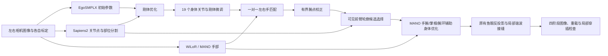

# 第一视角下视双目鱼眼相机估计身体姿态软件 V1.0

简称 **EgoSmplx**。输入下视鱼眼图像及相机标定，依次完成 EgoSMPLX 初始推理、Sapiens2 两阶段身体校正、WiLoR 手部推理、有界腕点与轮廓校正、MANO 辅助身体优化及原接缝融合，输出分阶段网格投影、参数、OBJ 和验收报告。

本仓库默认采用已确认的 **MANO 辅助身体优化 → 原有有界轮廓接缝融合**，配置名 `mano_guided_original_seam_20260929_v1`。旧 `session_hand6_full_pipeline_20260926_v1` 流程作为可选配置保留。自动拟合不读取人工标注。

**先读：[当前完整流程、参数、指标与恢复方法](docs/CURRENT_PIPELINE_zh.md)。** 新增阶段代码从已验证的八帧实验迁移；验证范围与结果见 [验证报告](docs/VALIDATION_zh.md)。[旧结果包流程](docs/REFERENCE_PIPELINE_zh.md)及旧重建记录继续保留，不能将旧验证直接视为新增算法已验证。



**双目范围：** 当前逐张处理 cam3、cam4，分别使用对应标定；不包含双目联合三角化、左右相机三维一致性优化或时序跟踪。最终融合网格需要 `fused/body_params.npz`、MANO 预测、融合配方和冻结的轮廓目标共同重建，不能仅靠一组标准 SMPL-X 参数恢复。

## 快速开始

```bash
git clone https://github.com/cdh290718-oss/EgoSmplx.git
cd EgoSmplx
python3 -m pip install -r requirements.txt
mkdir -p .local
cp configs/pipeline.example.json .local/pipeline.json
cp configs/frames.example.json .local/frames.json
```

修改 `.local/pipeline.json` 的 `manifest` 为 `frames.json`，填写解释器、外部模型仓库、模型权重、SHA-256 和输出路径；修改 `.local/frames.json` 中的图像及标定路径。示例 `/data/...` 都是占位路径。

```bash
python3 -m egosmplx_pipeline check --config .local/pipeline.json
python3 -m egosmplx_pipeline run --config .local/pipeline.json
# 原配置、代码、输入均未变化时，校验完整结果后续跑：
python3 -m egosmplx_pipeline run --config .local/pipeline.json --resume
```

`check` 检查输入和必需路径；模型会在实际 worker 中严格加载。本仓库不包含神经网络权重、SMPL-X/MANO 模型数据或第三方模型实现。首次部署还需准备三个模型环境及项目使用的 EgoSMPLX 后端接口，详见 [部署说明](docs/DEPLOYMENT_zh.md)。只安装根目录 `requirements.txt` 不能完成模型部署。

## 使用已有自动预测

将输入清单改为 `configs/frames.cached.example.json` 的结构，并指向对应图像的四类自动预测。缓存路线跳过网络推理，重新进行身体拟合和手部融合。

```bash
python3 -m egosmplx_pipeline run --config .local/pipeline.json --cached-predictions
```

旧 WiLoR 缓存缺少焦距字段时，只有核实其投影设置后，才可在配置顶层填写 `cached_wilor_focal_px`。已验证的旧 1280×720 缓存使用 25000 像素；新推理会直接保存实际焦距和图像尺寸，不应把这个数用于未知缓存。

## 从视频抽帧

```bash
python3 -m egosmplx_pipeline sample \
  --video /data/videos/left.mp4 \
  --calibration /data/calibration/cam3.egosmplx.json \
  --camera cam3 --count 4 --output outputs/cam3_samples
```

右相机同样执行一次，再合并两份清单的 `frames` 数组。抽帧采用各视频等分区间的中点，不能代替硬件同步或时间戳对齐。

## 输出与查看

```text
输出目录/
├── frames/<帧ID>/
│   ├── raw/       # 原始网络参数、mesh.obj、wireframe.jpg
│   ├── rigid/     # 仅 global_orient 和 transl 优化
│   ├── body_fit/  # 第二阶段身体关节点优化日志和诊断
│   ├── body/      # 规范化参数、mesh.obj、wireframe.jpg
│   ├── baseline_fused/ # 后续校正前的初始手部融合
│   ├── guided_body/ # 新增 MANO 辅助身体参数、网格、投影和优化日志
│   ├── fused/     # 增强身体＋原接缝：网格、冻结目标、投影和穿插诊断
│   └── validation.json
├── reference/     # 腕点、轮廓、guided/ 身体增强及原接缝阶段日志
├── observations/  # 原生推理路线的网络输出
├── index.html
├── contact_sheet.jpg
├── summary.json
└── run_state.json
```

完成后可以打包分阶段结果、输入图像、标定、重建所需的自动观测及运行源码：

```bash
python3 -m egosmplx_pipeline.package --run /data/results/new_run --archive /data/results/results_bundle_new.zip
```

打包前验证逐帧文件摘要，拒绝覆盖既有 ZIP；不包含权重和大型分割概率缓存。当前流程增加 `guided_body/`，四列依次为原始、Sapiens2 身体、MANO 辅助身体、最终融合。旧配置仍使用 `raw/body/fused` 三列。

`index.html` 使用相对路径；下载或分享时应携带同目录的 `*_comparison.jpg`，也可以直接分享 `contact_sheet.jpg`。这里的 RMSE 是对 **Sapiens2/WiLoR 自动目标点**的拟合误差，不是人工真值或三维精度。

## 文档与软著材料

- [软件设计说明书](docs/DESIGN_zh.md)
- [操作说明与异常处理](docs/USER_GUIDE_zh.md)
- [数据接口与误差定义](docs/DATA_FORMAT_zh.md)
- [验证报告](docs/VALIDATION_zh.md)
- [软著材料目录](copyright/README.md)：登记填表稿、设计说明书、源程序文档、权属核对清单，提供可编辑 DOCX 和 PDF。
- [源码来源清单](docs/SOURCE_PROVENANCE.json)、[第三方组件说明](THIRD_PARTY_NOTICES.md)

材料使用的名称由项目提出方确认。权利人、开发完成日期、开发方式及历史首次发表事实需要申请人如实填写，仓库公开时间不能自动代替软件首次发表日期。

## 测试

```bash
python3 -m unittest discover -s tests -v
# 相机测试还需在配置的 body_python 环境运行（含 PyTorch）。
python3 -m compileall -q egosmplx_pipeline tools
```

软著文档由仓库实际源码生成，源码统计和 SHA-256 同步输出，不补写无关代码凑页数：

```bash
python3 -m pip install -r requirements-docs.txt
python3 tools/export_copyright.py
```

当前八帧：身体自动点 RMSE 41.45→37.52 px，手部自动点 RMSE 14.91→17.62 px；8/8 重载通过，4/8 局部穿插检查通过。当前采用版本并非所有指标最优。

旧流程可通过 `pipeline_profile="session_hand6_full_pipeline_20260926_v1"` 选择；修改前恢复标签为 `checkpoint-before-mano-guided-flow-20260930`。切换流程使用新输出目录。

当前版本保留标准人体形状参数及身体姿态先验。它能限制身体任意变细或膨胀，但不能保证自动标注、遮挡区域、极端姿态或手腕接缝都正确；重载与拓扑检查通过也不代表视觉精度已经达标。
