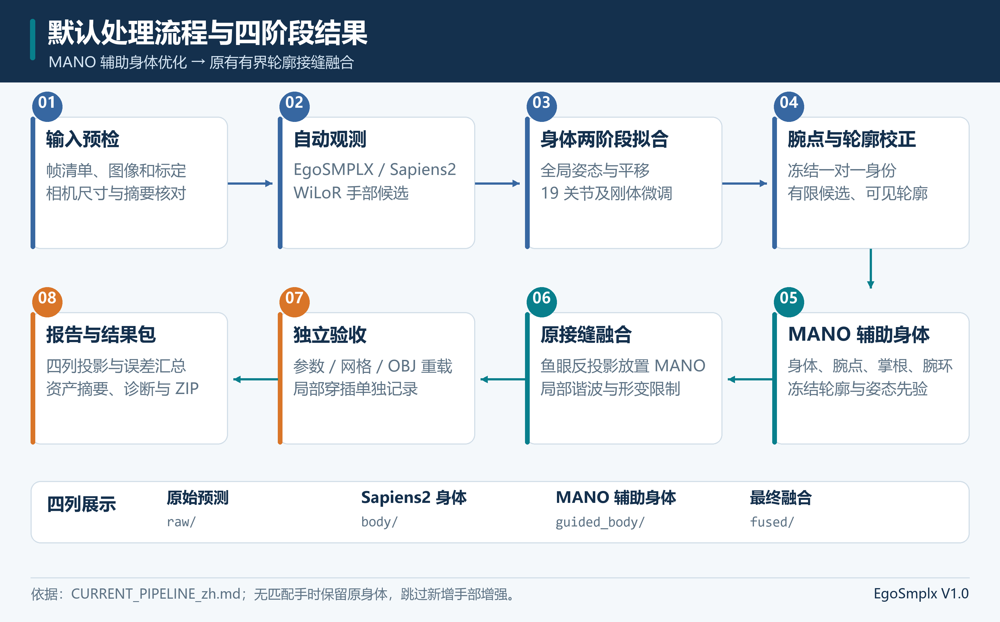
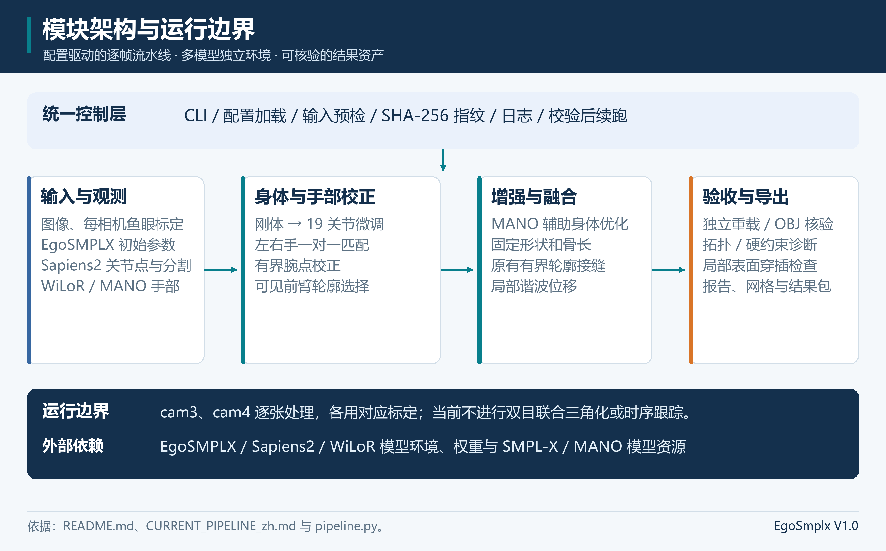
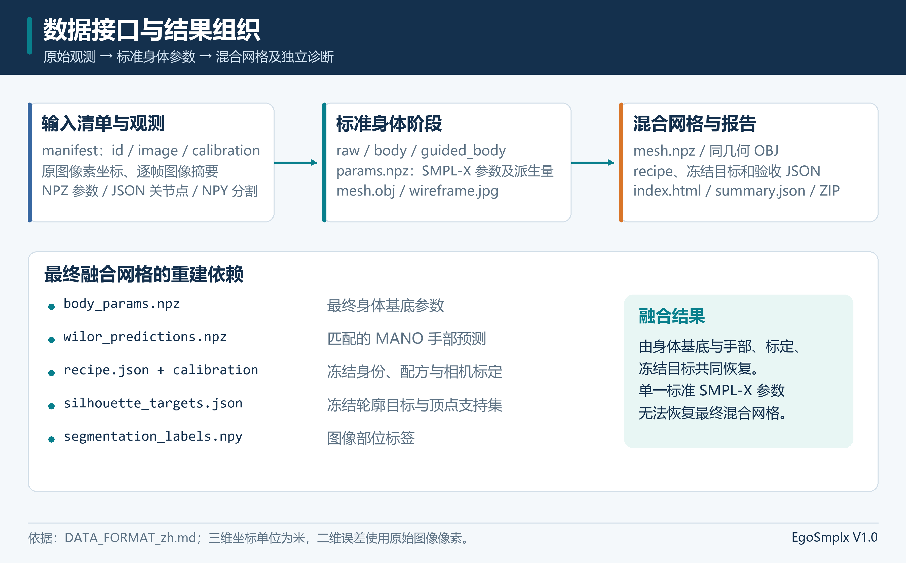
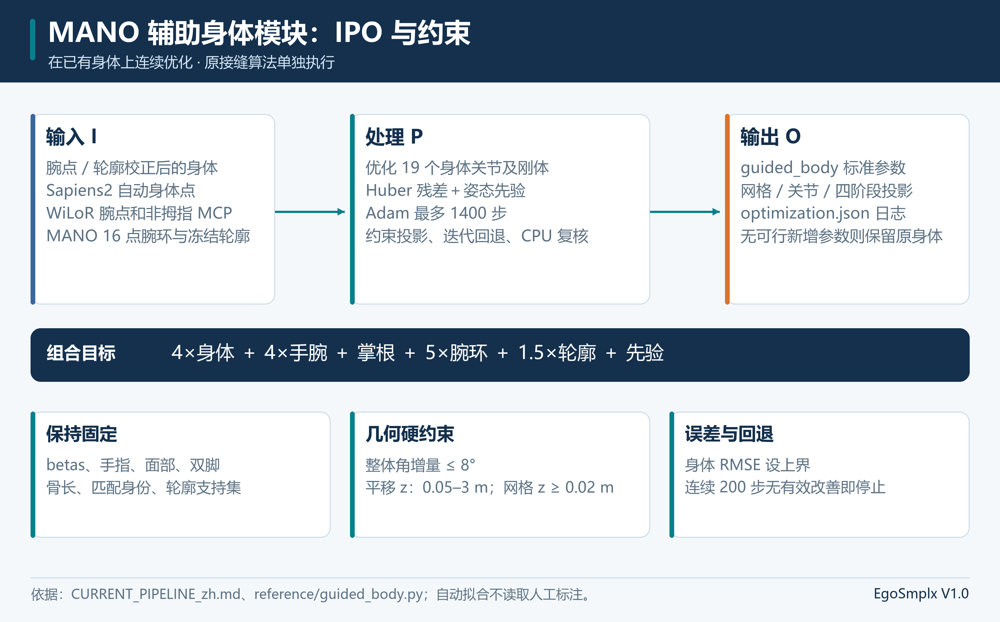
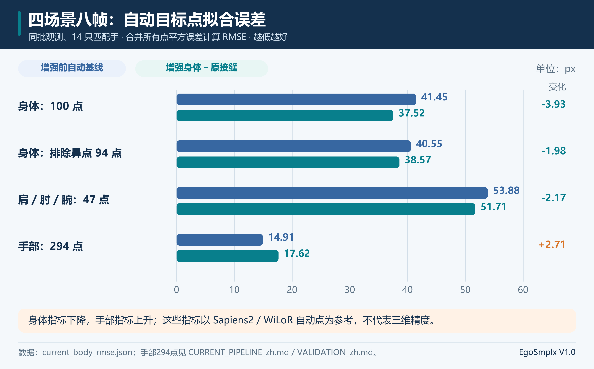
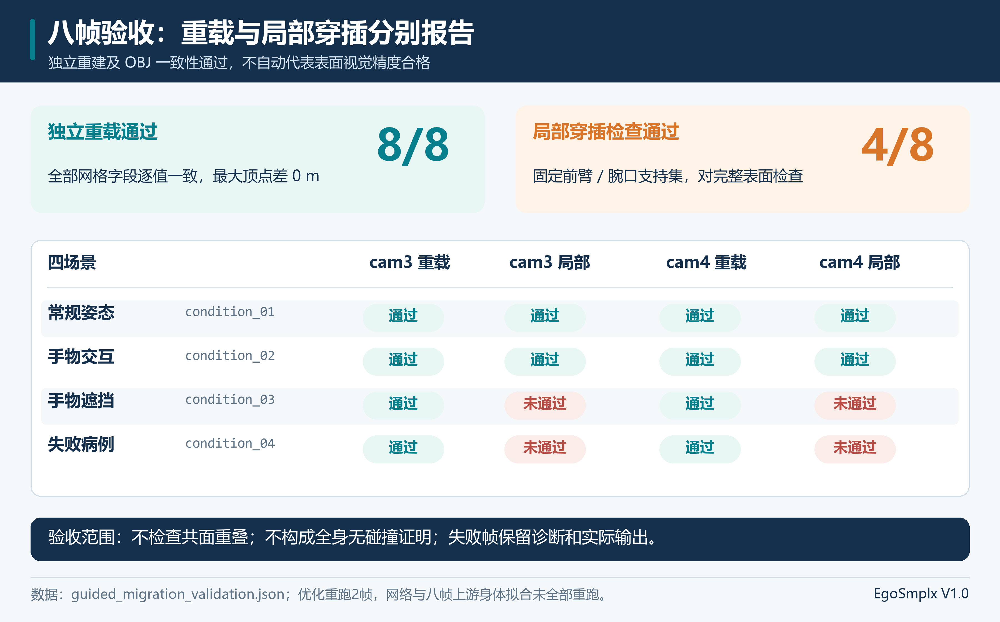

# 第一视角下视双目鱼眼相机估计身体姿态软件 V1.0

软件设计说明书

软件简称 EgoSmplx，登记版本 V1.0，程序包版本 1.0.0。本说明书对应 mano_guided_original_seam_20260929_v1 默认流程，解释从下视鱼眼图像、自动模型观测到身体拟合、MANO辅助身体、局部接缝、保存验证和结果展示的实现。

软件把每幅图像绑定其相机标定，输出原始、Sapiens2身体、MANO辅助身体和最终融合四阶段参数、网格、投影与报告。当前四场景八帧身体自动点 RMSE 41.45→37.52 px，手部自动点 RMSE 14.91→17.62 px；8/8重载通过，4/8局部穿插通过。自动目标误差、文件重建一致性、表面检查和人体真实精度分别解释。

本说明书包括概要设计、详细设计和验证结果。概要设计包含六章，详细设计先给程序结构，再对七个实际模块组分别说明十三项设计内容。软件名称与版本以根目录 software.json 为准。

## 第一部分 概要设计说明书

### 1 引言

#### 1.1 编写目的

本说明书为软件著作权登记提供与实际源码一致的技术说明，供开发、部署、测试和维护人员理解功能、参数约束、数据交接、数值计算及结果复现。读者可据此定位真实入口、核对几何过程、判断输出范围和安排部署验收。

#### 1.2 背景

软件全称为第一视角下视双目鱼眼相机估计身体姿态软件，简称 EgoSmplx，版本 V1.0。项目提出方提出下视鱼眼人体姿态处理需求，主要用户为第一视角数据处理、人体姿态研究和三维可视化人员；运行于具有外部模型环境的 Linux 工作站或服务器。项目提出者负责需求确认，开发维护者负责程序实现、环境配置和后续维护。

下视鱼眼图像包含强畸变、身体截断、近距离大手和手物遮挡。初始人体网络可能有平移、朝向或手臂偏差；直接接入单独手部模型也可能破坏原图大小或造成异常腕口。软件用 EgoSMPLX 提供人体初值，Sapiens2 提供原图身体点与可见部位，WiLoR/MANO 提供手部观测，通过受约束身体拟合和局部融合连接这些结果。

当前分别处理 cam3、cam4，并使用每侧标定。双目表示输入相机系统；本版本没有跨视角联合损失、双目三角化、严格时间同步、跨帧跟踪、动作分类或物体位姿估计。视频抽帧与左右相机批量提交均遵循此范围。

#### 1.3 定义

| 术语 | 定义与本软件中的含义 |
| --- | --- |
| SMPL-X | SMPL eXpressive；SMPL为Skinned Multi-Person Linear Model，外部参数化人体模型，按身体、手、面部参数生成标准网格 |
| MANO | Model with Articulated and Non-rigid defOrmations，外部参数化手模型；从 WiLoR 获取顶点、关节、姿态和形状 |
| ROI | Region of Interest，感兴趣区域；身体适配器采用连续去畸变区域和 aspect_pad 规则 |
| MCP | Metacarpophalangeal joint，掌指关节；增强阶段使用四个非拇指掌根点 |
| 轴角增量 | 用三维向量表示的旋转参数增量，限制的是向量范数，区别于每轴独立最大旋转 |
| 鱼眼径向距离 | 点到相机中心的欧氏距离，单位米；反投影 depth 使用此量，区别于 z 分量 |
| IPO | Input Process Output，输入 处理 输出，用于解释模块的数据变换 |
| RMSE | Root Mean Squared Error，均方根误差；二维点欧氏距离平方平均后开方，单位原图像素 |
| NPZ 与 OBJ | NumPy 压缩数组容器、Wavefront 三维网格文件，分别保存结构化数据和显式几何 |
| SHA-256 | Secure Hash Algorithm 256-bit，用于输入、代码、权重及产物内容摘要 |
| 重载验证 | 独立读取已保存参数和配方，重算几何，与 NPZ/OBJ 比较 |
| 局部穿插检查 | 至少一片三角形接触指定前臂支持集的非相邻、非共面三角形穿插检查 |

#### 1.4 参考资料

| 资料 | 编号或版本 | 来源及用途 |
| --- | --- | --- |
| 软件开发文档编写规范 | GB 8567-88 | 项目参考资料；使用概要设计说明书与详细设计说明书章节 |
| 登记元数据 | software.json，V1.0 | 仓库根目录；名称、版本及默认配置 |
| 当前流程说明 | CURRENT_PIPELINE_zh.md，2026-09-30 | docs；默认算法、参数及结果范围 |
| 数据接口与误差定义 | DATA_FORMAT_zh.md，当前仓库版本 | docs；坐标、数据字段、重建与 RMSE |
| 实际验证资料 | VALIDATION_zh.md 及对应 JSON/CSV | docs；执行范围、数值与问题帧 |
| 部署与后端契约 | DEPLOYMENT_zh.md、backend_contract.json、runtime_versions.json | docs；外部接口与已部署版本 |
| 来源与组件边界 | SOURCE_PROVENANCE、REFERENCE_CODE_PROVENANCE、GUIDED_CODE_PROVENANCE、THIRD_PARTY_NOTICES | 仓库；技术来源、摘要、第三方组件 |
| 面向第一视角鱼眼场景的人体姿态仿真数据集生成软件资料 | V1.0 | 项目参考资料；代码文档和设计说明书排版样本 |

仓库资料由本项目编写和发布，完整文档名及来源路径在表中列出。第三方组件的具体边界见 THIRD_PARTY_NOTICES.md，技术来源及文件摘要见相应来源清单。

### 2 总体设计

#### 2.1 需求规定

软件读取图像清单及各自标定，检查路径、尺寸、摘要与缓存。原生入口运行三个外部模型体系；缓存入口跳过网络，重新执行身体优化和融合，并保留该执行范围。

| 需求编号 | 输入与处理要求 | 输出要求 |
| --- | --- | --- |
| R01 | 解析配置、模型与解释器路径，拒绝不安全 ID 和不完整缓存 | 预检查、任务及内容指纹 |
| R02 | 对左右视频分别等区间取中点帧 | PNG、清单、零基帧号与近似时间 |
| R03 | 获得 EgoSMPLX、308点姿态、29类分割及 WiLoR/MANO | 原图自动观测和严格加载记录 |
| R04 | 先优化刚体，再优化19个身体关节及小幅刚体 | raw、rigid、body_fit、body 参数/网格/投影 |
| R05 | 左右手一对一匹配、腕点校正、可见轮廓候选 | 冻结身份与轮廓、候选及约束报告 |
| R06 | 固定体型与手指，用 MANO 腕点/掌根/腕环继续拟合身体 | guided_body 参数、网格与历史 |
| R07 | 鱼眼抬升手部、受约束腕环候选、局部谐波位移 | fused 显式几何、重建配方与接缝报告 |
| R08 | 独立重载、OBJ、拓扑、穿插及自动点统计 | validation、四阶段图、HTML、summary与 ZIP |

性能要求以有效数值、约束满足和可重建性为主。最终几何重载绝对误差阈值1e-5米，融合候选最小z≥0.02米。误差必须报告参考、点数与单位。当前没有独立真值集的三维精度、实时帧率或统一端到端耗时，不设未经测量的速度承诺。

#### 2.2 运行环境

控制器使用 Linux、Python3.8以上、NumPy、OpenCV、JSON和标准进程管理。完整网络推理需要 NVIDIA GPU；部署记录使用一张80GB GPU，此记录不是最小显存规格。两阶段身体优化使用CPU、默认两个线程；腕点、轮廓与新增身体增强优先GPU，局部谐波使用CPU SciPy稀疏求解。

| 环境标识 | 配置字段 | 职责与已记录版本 |
| --- | --- | --- |
| E01 身体环境 | body_python | EgoSMPLX、SMPL-X、融合；Python3.8.20、PyTorch1.12.1、CUDA11.3 |
| E02 姿态分割 | pose_python | Sapiens2；Python3.10.0、PyTorch2.7.0+cu128 |
| E03 手部环境 | wilor_python | WiLoR/MANO；Python3.10.0、PyTorch2.7.0+cu128 |

版本来源为 runtime_versions.json，不保证任意机器兼容。外部后端须提供 SMPL-X层、面片、关节名/索引、手部顶点索引与回归器；只安装根目录依赖不能完成模型部署。参考配置预检查仅接受1280×720图像，与对应标定尺寸一致。

#### 2.3 基本设计概念和处理流程

设计采用控制器与独立 worker，通过JSON/NPZ/分割数组交接。每张输入绑定自己的标定和原图摘要。网络观测、标准身体参数和显式融合几何逐阶段分开保存；参数变化后重新生成网格，避免过时派生几何。冻结匹配和轮廓使后续阶段可重建。

图中为软件设计流程，实际推理输出见第三部分；自动拟合不读人工关节点。缺失手一侧保留标准SMPL-X手，需有效手匹配的新增阶段跳过。

#### 2.4 结构

| 程序组 | 标识 | 实际源码 | 主要职责 |
| --- | --- | --- | --- |
| 输入与控制 | M01 | __main__.py、configuration.py、sampling.py、pipeline.py、profiles.py | 解析、抽帧、检查、调度、锁和续跑 |
| 自动观测 | M02 | egosmplx_predict.py、sapiens_pose.py、sapiens_seg.py、wilor_predict.py | 外部模型适配和原图观测 |
| 相机与身体 | M03 | camera.py、projection.py、body_common.py、body_rigid.py、body_pose.py | 标定投影、刚体及身体姿态拟合 |
| 匹配与前置校正 | M04 | matching.py、reference/wrist_refine.py、reference/silhouette.py、reference/contour_refine*.py、reference/select_candidates.py | 冻结身份、腕点与轮廓 |
| MANO辅助身体 | M05 | reference/guided_body.py | 固定体型/骨长连续拟合 |
| 局部网格融合 | M06 | lift.py、fusion.py、topology.py、reference/contour_seam.py、reference/guided_fuse.py | 鱼眼抬升、拓扑、腕环和谐波 |
| 验证与导出 | M07 | frame.py、reference/pipeline.py、reference/finalize.py、reference/surface_audit.py、render.py、report.py、package.py、io.py | 阶段导出、独立重建、报告与ZIP |

源码相对 egosmplx_pipeline/。bootstrap.py 和 reference/support.py 提供后端设置与公共约束。

控制器依次启动worker；当前没有常驻模型、自动多GPU调度或跨帧并发优化。

#### 2.5 功能需求与程序的关系

| 功能需求 | M01 | M02 | M03 | M04 | M05 | M06 | M07 |
| --- | --- | --- | --- | --- | --- | --- | --- |
| R01配置检查 | 实现 | 模型检查 | 标定检查 |  |  |  | 摘要 |
| R02视频抽帧 | 实现 |  |  |  |  |  | 清单 |
| R03自动观测 | 调用 | 实现 | 使用 | 使用 | 使用 | 使用 | 保存 |
| R04身体拟合 | 调用 | 初值 | 实现 |  |  |  | 导出 |
| R05匹配校正 | 调用 | 目标 | 约束 | 实现 |  | 基线 | 记录 |
| R06增强身体 | 调用 | 目标 | 约束 | 冻结目标 | 实现 |  | 导出 |
| R07局部接缝 | 调用 | 手部 | 投影 | 身份 | 身体 | 实现 | 诊断 |
| R08验证打包 | 状态 |  | 重建 | 配方 | 重建 | 重建 | 实现 |

#### 2.6 人工处理过程

部署人员合法准备模型、权重、SMPL-X/MANO资源与解释器，核实权重摘要、填写路径，选输入与对应标定。旧WiLoR缓存缺焦距时，须核实真实投影设置后填 cached_wilor_focal_px；不得对未知缓存套用25000像素。左右抽帧清单由人员合并，不构成同步校准。

使用人员查看投影、遮挡、腕部外观和失败诊断，再决定结果用途。此人工审核不作为拟合目标或候选选择依据。登记主体事实与权属由申请人提供，程序不代推断。

#### 2.7 尚未解决的问题

自动目标可能误标，单视图深度与遮挡歧义仍存在，局部限制不能消除全部鼓包/穿插。当前8帧4帧局部穿插失败、手部自动点误差未整体改善。双目联合、时序一致性、共面重叠和更可靠可见性如新增，应独立实现和验证，不记为V1.0已有功能。

### 3 接口设计

#### 3.1 用户接口

| 命令 | 语法 | 回答和输出 |
| --- | --- | --- |
| 检查 | python -m egosmplx_pipeline check --config 配置.json | passed、帧数、缓存模式与检查范围 |
| 原生运行 | python -m egosmplx_pipeline run --config 配置.json | 日志、输出目录、状态和结果 |
| 缓存运行 | run --config 配置.json --cached-predictions | 跳过网络，重新拟合/融合 |
| 续跑 | run --config 配置.json --resume | VERIFIED_RESUME或重算；变更任务拒绝 |
| 抽帧 | sample --video 视频 --calibration 标定 --camera cam3 --count 4 --output 新目录 | PNG及manifest；count正整数 |
| 打包 | python -m egosmplx_pipeline.package --run 运行目录 --archive 新包.zip | 路径、SHA-256和成员数 |

check/run需--config，run可组合缓存及续跑。路径填写本机真实位置；check通过只说明预检查，不替代worker严格模型加载。

#### 3.2 外部接口

OpenCV提供图像/视频解码与绘制；PyTorch提供模型与可微几何；SciPy提供稀疏求解；NumPy提供数组。subprocess调用三个解释器，CUDA_VISIBLE_DEVICES指定GPU。EgoSMPLX、Sapiens2、WiLoR分别负责外部模型，软件管理调用和数据适配。

EgoSMPLX接口由backend_contract.json记录，同名上游不一定有项目接口。Sapiens2严格加载并核对pose/seg摘要；WiLoR需要匹配配置、检测器与MANO。文件系统须支持新目录、原子替换、内容摘要和Linux文件锁。

#### 3.3 内部接口

raw/body/guided_body是标准SMPL-X参数；fused还需MANO、标定、冻结匹配、轮廓与分割，不能仅靠一组标准人体参数重建。

| 调用方与接收方 | 传值方式 | 关键内容与返回 |
| --- | --- | --- |
| CLI→configuration/pipeline | Python函数参数 | config路径、cached/resume标志；返回检查结果或输出目录 |
| pipeline→模型worker | subprocess参数列表及环境变量 | 图像清单、模型路径、输出目录、CUDA设备；退出码与日志 |
| pipeline→frame | --job job.json | config、row、output；逐帧validation.json |
| frame产物→reference阶段 | reference清单及NPZ/JSON文件 | 已有身体、刚体、Sapiens2、WiLoR、标定、冻结身份 |
| reference→阶段导出 | NPZ、recipe、targets、labels及诊断JSON | 标准身体/最终显式网格；返回阶段验收结果 |
| validation→report/package | records数组及运行目录 | 点误差、状态、profile、摘要；图像、summary、HTML或ZIP |

### 4 运行设计

#### 4.1 运行模块组合

| 运行方式 | 模块组合 | 支持环境 |
| --- | --- | --- |
| 原生当前 | M01→M02→M03→M04→M05→M06→M07 | 三模型环境、GPU、CPU/SciPy |
| 缓存当前 | M01→缓存检查→M03→M04→M05→M06→M07 | 身体后端、同图缓存和分割 |
| 旧session_hand6 | M01→观测/缓存→M03→M04→M06→M07 | 显式旧profile，三阶段输出 |
| 抽帧 | M01采样→PNG和清单 | OpenCV；后续另行run |
| 续跑/打包 | M01指纹核对→M07复用/报告/ZIP | 相同输入代码配置及验证产物 |

#### 4.2 运行控制

先资源与配置、再check、后原生或缓存run。默认profile为mano_guided_original_seam_20260929_v1，旧为session_hand6_full_pipeline_20260926_v1。步数为正整数、不能为bool；切换profile、代码、输入或参数后选择新目录。

控制器串行写running、progress、complete，非阻塞排他锁避免同目录冲突。worker标准输出与错误合并到日志，非零退出抛失败，不使用无效上游继续运行。

#### 4.3 运行时间

| 阶段 | 默认计算规模 | 主要时间与资源因素 |
| --- | --- | --- |
| 外部网络 | 每帧身体/姿态/手部，清单分割 | 模型装载、GPU、预处理、写盘 |
| 刚体/身体 | 1800/1600次更新 | CPU、SMPL-X前向/反向、点数 |
| 腕点/轮廓 | 500+400步；两个400步分支 | GPU/CPU、支持点、约束回退 |
| MANO辅助身体 | 最多1400步、200步无改善早停 | 冻结目标、约束投影、CPU复核 |
| 接缝 | 每侧29腕环候选 | 局部支持集、稀疏求解、验收 |
| 验证打包 | 每帧重建与逐文件摘要 | 网格、局部面片、磁盘速度 |

实际时间来自worker inference_seconds、elapsed_seconds及日志时间戳。批处理总体时间为实际帧处理与公共观测、报告和摘要之和，未实现跨帧并行。不同机器阶段时间不能拼成统一速度承诺。

### 5 系统数据结构设计

#### 5.1 逻辑结构设计要点

| 标识 | 数据项 | 类型、长度与有效范围 | 关系 |
| --- | --- | --- | --- |
| D01 Frame | id/image/calibration及可选camera/predictions | 安全唯一ID；1280×720图像 | manifest.frames逐帧 |
| D02标定 | size、polynomialC2W、polynomialW2C、intrinsic或image_center；可选affine或c/d/e、camera_axis_transform | [W,H]；affine含3项；camera_axis_transform为3×3有限正交矩阵 | 每帧独立标定 |
| D03身体 | body_pose、betas、global_orient、transl、双手/面部 | body_pose21×3；刚体3分量；其余按后端 | 重生成网格/关节/像素 |
| D04身体点 | 图像摘要/尺寸、coordinate_space、命名点 | 308个x/y/score；身体13候选 | 仅有限/图内/score≥0.3 |
| D05分割 | labels、probabilities、class_ids | H×W uint8；29×H×W float16概率 | 六类并集轮廓 |
| D06手部 | bbox/confidence/is_right、姿态/形状/cam_t、点/顶点 | 每候选21×2/21×3/778×3；可零候选 | 焦距/尺寸/摘要绑定 |
| D07配方 | matches、method、轮廓截面与支持集 | 左右各最多一候选，身份冻结 | 完整融合输入链 |
| D08网格 | vertices/faces、手/身体关节、局部映射 | V×3/F×3，索引由实际模型 | 同OBJ及重建比较 |
| D09验证 | 点误差、重载、passed、surface、摘要 | 单位米/像素；surface三态 | 每帧汇总summary |

SMPL-X形状/表情长度及完整网格数量按部署模型契约，不把其他后端维度当常数。global_orient_network/transl_network保留真实网络刚体初值。身体骨架与最终网格回归手部是不同数据来源。

#### 5.2 物理结构设计要点

JSON使用UTF-8、有限数值、临时写入再替换。NPZ读取禁pickle、拒绝非有限数组，输出压缩。三维坐标米、图像坐标原图像素；不把不同单位混为一个误差。

| 存储位置 | 存取单位/方法 | 索引与设计考虑 |
| --- | --- | --- |
| observations | 按模型/帧JSON、NPZ、数组 | 摘要绑定原图 |
| frames/ID/raw、body、guided_body | 每阶段参数、OBJ、JPG | 标准参数独立重算 |
| frames/ID/fused | 显式NPZ/OBJ、body、MANO、配方、标签、轮廓 | 完整最终重建链 |
| reference | 按condition/camera中间文件 | 腕点、轮廓、guided、接缝 |
| jobs/state/validation/summary | 帧ID、状态及摘要 | 复用与完整性索引 |
| comparison/HTML/ZIP | 相对路径或成员清单 | HTML无远程脚本；ZIP不覆盖 |

29×720×1280 float16概率未压缩约51MiB/帧，uint8标签约0.88MiB；float32概率内存约102MiB，还须模型、图像和优化张量。容量按帧数及实际压缩率规划。结果包不含权重与大型完整概率缓存，保留最终重建标签及冻结目标。

图像可能含人物和场景信息，访问权限由部署系统管理。共享前审核图像、路径及日志；摘要只验证一致，不提供加密、账户权限或自动脱敏。

#### 5.3 数据结构与程序的关系

| 数据 | M01 | M02 | M03 | M04 | M05 | M06 | M07 |
| --- | --- | --- | --- | --- | --- | --- | --- |
| D01清单 | 读写 | 读 | 读 | 读 | 读 | 读 | 读 |
| D02标定 | 检查 | 读 | 读 | 读 | 读 | 读 | 打包 |
| D03身体 | 调度 | 初值 | 读写 | 读写 | 读写 | 读 | 重建导出 |
| D04身体点 | 摘要 | 生成 | 读 | 读 | 读 | 评分 | 统计 |
| D05分割 | 摘要 | 生成 |  | 读 | 读 | 读 | 标签打包 |
| D06手部 | 摘要 | 生成 |  | 读 | 读 | 读 | 重建 |
| D07配方 |  |  |  | 生成 | 读 | 读写 | 核验 |
| D08网格 |  |  | 标准 | 基线 | 标准 | 最终 | 核对 |
| D09验证 | 续跑 | 加载 | 约束 | 候选 | 优化 | 验收 | 汇总 |

### 6 系统出错处理设计

#### 6.1 出错信息

| 出错情况 | 输出形式/含义 | 处理方法 |
| --- | --- | --- |
| 变量/ID错误 | ValueError，Unresolved environment variable、unique safe filenames | 补变量/修清单，计算前拒绝 |
| 尺寸不符 | requires1280×720、sizes differ | 对应原图/标定；不缩放套用 |
| 缓存缺失/过时 | FileNotFoundError、Stale Sapiens2 observation | 完整同图缓存或原生入口 |
| 权重/接口错误 | SHA-256 mismatch、strict load异常、worker失败 | 核日志和后端资源版本 |
| 点不足/退化 | 至少4点和二维分布错误 | 保留失败，不人工补点 |
| 非有限数值 | Nonfinite NPZ/objective/gradient | 拒绝结果，检查输入模型 |
| 无可行候选 | 约束失败、拒绝步/回退记录 | 按阶段前一可行结果或失败 |
| 重载不一致 | Saved geometry failed reload validation | 拒绝可信完成状态 |
| 局部穿插 | local_surface_accepted=false及面片诊断 | 保留失败供审核 |
| 目录/锁/变更续跑 | FileExistsError、lock或fingerprint错误 | 新目录或原任务验证续跑 |

#### 6.2 补救措施

后备通过保留输入、标定、自动观测、身体参数、融合配方和摘要支持重建。受损/未完成目录改名保留再重算；用户可备份结果和ZIP，程序未实现自动异地备份。

降效可按小清单分批、使用验证同图缓存，以及由允许的后续优化模块CPU执行。缓存仍需SMPL-X后端，完整网络不能仅凭根依赖成为普通CPU服务。改配置后必须新目录。

--resume先核配置/输入/核心代码指纹，再核逐帧产物摘要，通过才复用；失败帧重算。标准身体可由参数重生成，fused需完整重建依赖。现有恢复为帧/阶段级，不提供任意优化步断点。

#### 6.3 系统维护设计

检测点包括preflight、严格加载、固定参数、硬约束、独立重载、OBJ、摘要和局部穿插。优化JSON保留目标、步数、拒绝更新及回退比例，来源清单保留文件来源与摘要。先查worker日志及输入链，再查profile/代码，后核阶段参数和诊断。数值修改后执行相关回归和模型环境验证，源码材料统计真实程序，不填无关代码凑页。

## 第二部分 详细设计说明书

### 1 引言

#### 1.1 编写目的

面向实现、测试和维护人员，说明七个实际程序组的输入输出契约、算法和验收。共同环境、参考资料和安全条件明确沿用概要条目，各组补充特性。

#### 1.2 背景

名称、版本、主体事实及运行中心按概要1.2和software.json；详细设计针对当前默认MANO辅助身体加原接缝，旧session_hand6为显式兼容配置。

#### 1.3 定义

术语沿用概要1.3。raw为网络刚体初值，body为两阶段身体，guided_body为新增增强，fused为局部显式表面。身体运动学骨架与从最终网格回归手关节区别处理。

#### 1.4 参考资料

资料沿用概要1.4。程序源码相对egosmplx_pipeline/，测试在tests/，实际证据在docs/JSON/CSV；日期和范围见第三部分。

### 2 程序系统的结构

| 层次 | 实际程序/子程序 | 控制及数据关系 |
| --- | --- | --- |
| L01入口 | __main__.main、package.main | 调用配置、控制、采样或打包 |
| L02调度 | load_config、preflight、pipeline.run/observe/command/fingerprint | 任务、worker、锁与状态 |
| L03观测 | egosmplx_predict、sapiens_pose/seg、wilor_predict | 外部模型与观测文件 |
| L04单帧 | frame.run/canonicalize、body_rigid/pose.main | 原始重建、刚体、身体、基线 |
| L05前置/增强 | reference.pipeline、wrist_refine、contour_refine、select_candidates、guided_body.fit | 冻结目标连续优化 |
| L06融合/审查 | contour_seam.build/harmonic、guided_fuse、finalize、surface_audit | 原接缝、约束与独立重建 |
| L07公共输出 | render、report.build、package.package、io、bootstrap、support | 图像/OBJ/统计/ZIP及接口 |

图2给层次框图。以下M01至M07每组十三项；共同要求明确引用概要，不因同类模块省略。

### 3 M01 输入配置与控制程序设计说明

#### 3.1 程序描述

由__main__.py、configuration.py、sampling.py、profiles.py、pipeline.py实现，是顺序批处理控制器，任务期间运行、完成退出。外部模型为子进程，无常驻模型服务。Linux fcntl文件锁保护输出目录，不允许两个任务同时改写。

#### 3.2 功能

IPO：输入配置、图像/视频和运行标志；处理路径展开、输入核查、均匀抽帧、worker调度和指纹；输出规范化清单、任务、日志、状态与结果。保证后续计算采用明确profile及每帧对应标定。

#### 3.3 性能

检查优先于输出计算，摘要分块读取。逐帧串行，OMP/MKL线程设置为2；时间随文件大小、外部worker和磁盘增长。对全部帧核ID、输入与摘要，不承诺实时。预检查模型路径不替代实际严格加载。

#### 3.4 输入项

--config为JSON，含manifest/output/paths/gpu/fitting/profile；frames至少一项，id仅字母数字下划线连字符且不重复。三个拟合步数正整数、非bool。sample读取视频、标定、camera、count和新output。输入从本地文件一次载入或逐帧读取，权限由部署系统控制，数据来源由使用人员确认。

#### 3.5 输出项

preflight.json记录检查范围；jobs每帧config/row/output；progress为完成数；run_state为指纹和状态。sample输出PNG、manifest、零基帧号及近似时间。RUN/FRAME_COMPLETE/VERIFIED_RESUME为回答消息，完整结果由M07输出。按帧/任务写文件，不传远程服务；共享前审核路径及图像。

#### 3.6 算法

相对路径以配置/清单目录为基准，${PACKAGE_ROOT}替换仓库根，其他变量环境展开，残留变量拒绝。视频n帧、K样本时第k个索引min(n-1,floor((k+0.5)n/K))。指纹把配置、输入/缓存及核心.py摘要有序JSON序列化后再SHA-256。

#### 3.7 流程逻辑

解析→配置清单→preflight→新目录/续跑→锁→观测或缓存→逐帧worker→参考阶段→报告→complete。续跑仅复用passed且逐产物摘要一致的帧；未完成/损坏目录先改名保留再重算。变化任务拒绝旧目录续跑。

| 条件 | 处理 | 输出 |
| --- | --- | --- |
| 新任务且输入有效 | 创建目录并取得锁，启动worker | 运行中任务及日志 |
| 续跑且指纹、全部产物摘要一致 | 复用已完成帧 | VERIFIED_RESUME记录 |
| 配置、输入或代码已变化 | 拒绝原目录续跑 | 要求使用新目录 |
| 单帧未完成或产物损坏 | 改名保留后重算 | 新结果及旧失败现场 |

#### 3.8 接口

上层为CLI，下层M02/M03/M07及reference.pipeline。command接收参数列表、log、cwd、env，subprocess.run不通过拼接shell解释参数。job JSON为控制器与frame worker接口，图3给出数据链。

#### 3.9 存储分配

内存保留清单、摘要字典和记录列表；几何由worker管理。目录分observations/jobs/frames/reference及日志状态。抽帧逐次解码一帧，已存在输出拒绝覆盖；不使用计算中间文件作跨任务共享缓存。

#### 3.10 注释设计

首部说明命令、顺序和续跑范围；变量展开、后端时间戳目录兼容及incomplete保留分支说明理由。抽帧注明未证明同步，缓存注明网络未重新运行，指纹注释说明包含输入、配置和核心代码。

#### 3.11 限制条件

依赖Linux文件锁与配置解释器，当前参考profile仅1280×720。FPS只用于近似时间，不证明双目同步。改变代码/输入/配置须新目录，存在结果必须明确--resume。

#### 3.12 测试计划

部署人员在首次部署时检查必需路径和同图缓存。每次配置逻辑变更后，维护人员运行 tests/test_core.py 和 tests/test_guided_profile.py 中的变量展开、帧ID、未知profile及步数测试；输入使用临时JSON和目录，预期非法输入在计算前拒绝，合法配置正确选择。测试人员在目标Linux环境另行验证目录锁冲突、已有输出、损坏产物续跑及配置变化拒绝，并保存日志作为部署验收记录。

#### 3.13 尚未解决的问题

没有常驻模型、多节点队列、自动多卡调度及任意迭代断点恢复。抽帧不能解决硬件同步，新分辨率需重验像素阈值及后端。

### 4 M02 自动观测程序设计说明

#### 4.1 程序描述

由egosmplx_predict.py、sapiens_pose.py、sapiens_seg.py、wilor_predict.py构成，在各模型环境加载模型、推理后退出。软件适配调用和输出，外部架构、权重、检测器及模型资源由对应组件提供，非本组重新训练。

#### 4.2 功能

IPO：原图、标定、后端/权重→身体网络、308点姿态、29类分割、手部检测回归→人体NPZ、身体点JSON、分割数组、MANO预测。所有拟合目标来自自动模型，不读取人工标注。

#### 4.3 性能

网络使用GPU，Sapiens2 bfloat16 autocast，热图/logits转float32后解码/缩放。输出尺寸正确、数值有限，分割每像素概率和接近1。严格加载/摘要验证是完整性条件，非准确率证明；实际时间显存在worker记录。

#### 4.4 输入项

每帧原图及标定、身体config/checkpoint；pose/seg safetensors及可信SHA-256；WiLoR checkpoint/config/detector/MANO。姿态bbox为原图内有效框，控制器默认全图。输入文件在任务启动读、图像按帧读；来源授权与权限按概要5.2，不能从示例占位路径取得模型。

#### 4.5 输出项

身体参数保留global_orient_network/transl_network。姿态308个name/x/y/score、原图尺寸摘要与坐标；分割H×W标签、29×H×W概率；手部每候选21点、778顶点、cam_t、左右、实际焦距/尺寸/摘要。无手仍保存零候选NPZ，按帧本地输出；score非校准可见概率。

#### 4.6 算法

EgoSMPLX用det_undistort_contiguous/aspect_pad。Sapiens2官方keypoints308 test_pipeline、UDPHeatmap解码及配置翻转测试，按bbox缩放/中心恢复原图。分割float32 logits双线性恢复H/W，再softmax/argmax，float16保存概率。WiLoR按后端恢复左右镜像及相机字段。

#### 4.7 流程逻辑

图像/权重检查→构建模型→strict load→GPU eval→官方预处理→inference→原图恢复→维度/数值检查→文件/manifest。身体预测须唯一对应佩戴者，否则拒绝。缓存入口绕过本组，不能写成本次重新网络推理。

| 条件 | 处理 | 输出 |
| --- | --- | --- |
| 图像、摘要、后端均有效 | 严格加载并执行官方推理 | 原图绑定的观测文件 |
| 无有效手检测 | 保存零候选手部NPZ | 后续保留标准手部 |
| 权重不匹配或身体预测不唯一 | 退出并保留日志 | worker失败记录 |
| 选择缓存路线 | 跳过本组网络 | 已存在自动观测，范围明确 |

#### 4.8 接口

pipeline.observe以列表参数启动三个解释器，下层为已部署EgoSMPLX/Sapiens2/WiLoR。predictions.egosmplx/sapiens/segmentation/wilor向M03至M06交接，原图SHA-256、尺寸、coordinate_space和焦距绑定观测。

#### 4.9 存储分配

GPU模型/输入，CPU解码输出。概率容量见概要5.2，权重不进入公开结果。原生输入复制到observations/images，按模型/帧日志保存；大分割概率缓存和最终重建标签分离。

#### 4.10 注释设计

注释说明后端输入模式、bbox恢复、翻转索引、左右镜像、焦距。manifest记strict_load、摘要、精度/版本。heatmap score/softmax不作为校准可见性或准确概率，相关字段说明保留。

#### 4.11 限制条件

外部模型或项目接口缺失无法运行，仅根依赖不够。遮挡、鱼眼、截断、误检影响目标。替换微调权重须架构配置兼容并独立验证，训练集名称不保证新场景精度。

#### 4.12 测试计划

模型部署人员在首次部署或权重变更后，使用目标GPU和合法模型资源完成一帧原生冒烟测试，检查严格加载、摘要、点数、尺寸及原图坐标。维护人员准备空手、多检测、无效bbox、错误摘要及损坏图像测试，预期零候选正常保存，错误权重和输入被拒绝。测试人员保存manifest和输出图供验收；本次文档整理没有重新执行神经网络推理。

#### 4.13 尚未解决的问题

目标准确性、可见性概率校准及跨设备差异需独立评估。没有自行训练新模型、全量人工真值结果或任意同名上游接口兼容保证。

### 5 M03 相机与两阶段身体程序设计说明

#### 5.1 程序描述

camera.py/projection.py为公共投影；body_common.py/body_rigid.py/body_pose.py为有限步CPU拟合，bootstrap接入标准SMPL-X层。只优化每帧参数，不训练模型。第一阶段仅刚体，第二阶段19身体关节及小幅刚体。

#### 5.2 功能

IPO：标定、原始人体、同图身体点→鱼眼正反投影、刚体及姿态拟合→身体参数、重新生成几何、原图关节、历史/约束。固定体型、手指、脚及面部参数，参数变化后重新生成派生字段。

#### 5.3 性能

投影有限可微，高阶逆多项式FP64 Horner后返回输入类型。最终重载阈值1e-5米；刚体参数重合成另外核约1e-4米/0.05px。原始网络GPU到CPU初值重建1e-3米为独立舍入诊断门限，不替代最终要求。

#### 5.4 输入项

标定D02，affine行列式c-de非退化、轴变换有限正交。13身体候选中选score≥0.3、有限图内点，至少4点，刚体要求二维分布非退化。NPZ包含固定参数与网络原始刚体字段。逐帧本地读取，单位米/原图像素、安全条件按概要。

#### 5.5 输出项

rigid/optimized_params保存global_orient/transl及重生几何；body_fit/automatic/refined_params保存19关节/刚体，body/params规范化，OBJ/JPG/JSON记录目标、误差、固定项和约束。每阶段每帧一组文件，采样步记录history；公开前按输入权限审核。

#### 5.6 算法

轴变换后(x,y,z)，r=sqrt(x²+y²)，theta=atan(-z/r)，rho=sum_k a_k theta^k。x′=x rho/r、y′=y rho/r，u=cx′+dy′+u0、v=ex′+y′+v0。反投影逆affine后以C2W多项式求射线、归一化乘径向距离，再逆轴变换。

刚体旋转绕骨盆合成，仅global_orient/transl。残差(投影-目标)/[W,H]用Smooth L1 beta0.005、截断score平方权重，加入平移/旋转先验和近深度惩罚。默认1800次Adam，旋转增量范数≤60°，transl.z∈[0.05,3]米。

第二阶段默认1600步，19关节开放，脚、betas、双手、jaw/eyes/expression固定；身体点统一权重，Smooth L1 beta0.003。姿态/平移/朝向先验0.0008/0.0002/0.0004，腕距屏障0.002、深度屏障0.02且从0.03米起。可行结果需网格z≥0.02米、腕距≥刚体初值85%、整体增量≤8°；本阶段不加轮廓。

| 关节 | 轴角增量范数上限 |
| --- | --- |
| 髋/膝/踝 | 18°/22°/14° |
| 三段脊柱 | 10°/10°/12° |
| 颈/头 | 各12° |
| 锁骨/肩/肘/腕 | 15°/28°/25°/15° |

上限相对刚体阶段姿态，不表示每轴独立最大角。

#### 5.7 流程逻辑

恢复网络刚体→重建→自动点筛选→刚体1800步→合成轴角再生成→姿态1600步→可行候选目标选优→固定项核对→保存重载。非有限梯度或无可行结果失败，不放宽限制强行输出。

| 条件 | 处理 | 输出 |
| --- | --- | --- |
| 至少4个有效且非退化自动点 | 运行刚体后运行姿态拟合 | 可保存的标准身体参数 |
| 优化候选满足角度、腕距和深度 | 按总目标保留最佳 | 参数与约束报告 |
| 候选违反硬约束 | 不进入最佳选择 | 拒绝记录 |
| 数值非有限或无可行结果 | 中止并保留日志 | 失败诊断 |

#### 5.8 接口

上层frame.run，下层SMPL-X和标定，相机供M04至M07。canonicalize每次参数变化调用geometry更新网格/关节/root_relative/pixels。NPZ交接、JSON及原图摘要绑定目标。

#### 5.9 存储分配

CPU存参数、网格、关节、19×3增量、整体和平移及最佳候选。SMPL-X层requires_grad=False，仅开放参数保留梯度；FP64投影临时张量不扩增全部模型存储。

#### 5.10 注释设计

说明骨盆旋转中心、刚体合成、Horner数值原因、径向深度及固定项。角字段写axis_angle_increment、深度写m。raw可有背向顶点，绘图裁剪不说明其已满足优化深度。

#### 5.11 限制条件

有限步非凸拟合无全局最优保证，错误自动点可能驱动错误身体。r=0、退化标定/目标、尺寸错拒绝；固定体型限制任意缩细膨胀，但不确定真实深度/遮挡。

#### 5.12 测试计划

维护人员在body_python环境运行 tests/test_projection.py，检查NumPy与Horner投影一致、梯度有限、径向反投影和奇异affine拒绝；每次数值模块修改后执行。测试人员使用目标帧自动观测和SMPL-X资源，核对固定参数、角度、腕距、深度及参数重新生成结果，预期分别满足对应门限，并保存参数和日志。已有单帧缓存控制器证据在第三部分单独列出。

#### 5.13 尚未解决的问题

极端初值、误标及单视深度歧义仍可失败。后端/硬件舍入需重核，不承诺跨平台逐位一致或人体三维真值精度。

### 6 M04 匹配腕点与轮廓程序设计说明

#### 6.1 程序描述

matching.assign为无模型子程序，reference/wrist_refine、silhouette、contour_refine、contour_refine_strong、select_candidates为顺序受约束优化。身份选后冻结，分割左右误分类不改变匹配。

#### 6.2 功能

IPO：身体、自动肘腕、WiLoR、分割→一对一分配、腕点/可见截面、轮廓分支→matches、前置身体、冻结目标/验收。缺失手保留SMPL-X，不人工补点或复用另一侧检测。

#### 6.3 性能

左右组合枚举保证检测仅用一次。校正保持固定项、累计角度、深度/腕距，身体RMSE相对两阶段最多约退化5px。轮廓需重复有效截面，不直接拉动任意顶点，未满足一侧不启用。

#### 6.4 输入项

候选confidence≥0.25、距锚点≤150px、至少12有限图内手点。锚点优先可信Sapiens2腕，缺失用身体腕。分割原图尺寸，方向为同侧Sapiens2肘到WiLoR腕；并集类6/7/11/15/16/20。按帧本地读取，隐私/权限沿用概要。

#### 6.5 输出项

matches存candidate/confidence/腕距/左右一致/anchor_source。轮廓按侧enabled/bins/vertex_ids/原因及身份来源；校正、普通/强分支参数、拒绝步、CPU复核。每帧输出多个分支文件，后续冻结引用，不删除失败诊断。

#### 6.6 算法

C=腕距+45×左右不一致+20(1-confidence)，未匹配180，枚举一对一最小总成本。腕点500步再400步主动投影，身体项、4倍WiLoR腕、腕环半径、先验与屏障。

沿肘腕t∈[0.15,0.88]取12横截线，连续区域≥8px、两端可见、六类概率并集>0.55、中心不过度偏离；至少3截面、至少12模型支持顶点并排除手顶点。损失区域外平方、越图、0.5边界覆盖，/10000。0.08和0.4两400步分支同一腕点初值，强分支纳腕环，统一可行性/评分选优。

#### 6.7 流程逻辑

筛候选→枚举左右→冻结→基线→腕点投影校正→可见截面→普通/强分支→验收选优→冻结身体轮廓。无证据不推断隐藏前臂，不对遮挡手物边界加目标。

| 条件 | 处理 | 输出 |
| --- | --- | --- |
| 候选通过置信、距离和点数检查 | 全局一对一配对并冻结 | 左右matches |
| 一侧无有效候选 | 保留该侧SMPL-X手 | 缺失状态 |
| 至少3条可见截面且支持顶点足够 | 运行普通与强轮廓分支 | 候选参数和评分 |
| 轮廓证据不足或更新不可行 | 该侧禁用轮廓或按约束回退 | 启停原因与前一可行结果 |

#### 6.8 接口

上层reference.pipeline，下层support.constraints、SMPL-X、相机、silhouette.loss/metrics。matches给M05/M06，targets和labels给最终重建，图3冻结配方为本组输出。

#### 6.9 存储分配

候选代价表、组合、分割并集/距离图、截面及支持集；GPU选目标和可微距离采样。保存所有分支诊断，概率不进入公开最终包。

#### 6.10 注释设计

左右标签是代价而非绝对身份，阈值原图像素。说明六类并集、可见截面、非隐藏推断、手物遮挡排除和回退身体容限。

#### 6.11 限制条件

150/45/180像素参数针对1280×720，其他分辨率需迁移验证。误腕/误检可匹错，分割非真实边界；无跨帧身份或跨相机共同匹配。

#### 6.12 测试计划

维护人员在匹配逻辑修改后运行 tests/test_core.py 的单候选防复用、低置信与空候选测试，预期同一检测仅分配一次，缺失手保留标准手部。测试人员在目标模型环境使用无遮挡、缺少肘点、断裂分割和双手接近样本，检查截面启停、身份冻结及硬约束，保存目标图和分支JSON。接口或阈值变化后重新执行相应验收，测试计划不代替实际执行记录。

#### 6.13 尚未解决的问题

遮挡、左右误检和错锚点影响匹配；轮廓非真实半径，二维贴合不能证明接缝自然。旧8帧分支记录不替代当前数据独立证据。

### 7 M05 MANO辅助身体程序设计说明

#### 7.1 程序描述

核心reference/guided_body.py的fit连续优化已有腕点/轮廓身体，位于轮廓选择后、最终融合前；保持相同初始化、身份、标定及冻结轮廓，不人工重定位。优先GPU，结束CPU独立复核。

#### 7.2 功能

IPO：前置身体、原身体/刚体、WiLoR原生点/腕环、冻结轮廓→有界连续优化和CPU回退→guided_body标准参数、重生几何、optimization。改变身体/刚体，保持体型、骨长、手指、脚及面部。

该阶段更新标准身体参数，后续原接缝独立修改局部显式顶点。

#### 7.3 性能

默认最多1400步，200步最佳目标改善未超过1e-7则停；原累计角限、整体≤8°、平移z0.05–3米、全网格z≥0.02米。腕距≥原身体/刚体较大距离85%；身体RMSE≤min(原两阶段+5px，增强前+0.5px)。可行不等于所有指标改善。

#### 7.4 输入项

身体NPZ、初始混合网格、Sapiens2、WiLoR、recipe、labels与silhouette_targets；snapshot_sha256逐项绑定。身体13映射筛选，每匹配手腕、4非拇指MCP、16腕环。MANO使用原生投影，不预先平移身体腕。每帧一次读本地冻结资产，安全按概要5.2。

#### 7.5 输出项

gpu_candidate.npz保GPU候选；body_params为CPU复核，OBJ/JPG及optimization记录历史、回退比例和前后指标，导出guided_body。无可行新参保原身体并记录；无匹配帧跳过。标准参数和派生几何均本地保存，频度按帧/阶段。

#### 7.6 算法

L=4L身体+4L腕+L掌根+5L腕环+1.5L轮廓+L先验。像素Huber阈值20px，/10000；身体score平方归一化加权并加0.15倍平方项。先验0.003×(关节增量/上限)平方均值、0.001×(平移差/[0.10,0.10,0.18])平方均值、0.001×(整体增量/8°)平方均值。

Adam关节/整体/平移学习率0.002/0.0008/0.0015。每更新限角并投影非线性约束，违规向前一步回退，仅保存改善>1e-7的可行最优。CPU从候选向增强前参数每次×0.9缩步最多30次，仍不可行完全回退；重生几何，核固定项。

#### 7.7 流程逻辑

冻结摘要→目标及原约束→19关节/刚体增量→目标梯度→Adam→投影/回退→最佳更新或早停→CPU复核缩步→固定项→保存重建。图4的验收反馈为此流程，最终接缝不在本组目标中直接改顶点。

| 条件 | 处理 | 输出 |
| --- | --- | --- |
| 有效手匹配及冻结目标完整 | 连续优化19关节和刚体 | 可行GPU候选 |
| 更新违反硬约束或RMSE上界 | 投影并向前一步回退 | 拒绝或缩步记录 |
| CPU复核不通过 | 向增强前参数逐次缩步 | 合格参数或完整回退 |
| 无匹配手或未找到可行新参数 | 跳过增强或保留原身体 | 明确状态及未变化参数 |

#### 7.8 接口

reference.pipeline设清单及EGOSMPLX_REFERENCE_ROOT；get_rows/context绑定输入；下层support.geometry/constraints、SMPL-X、相机、silhouette.loss；metrics输出残差，guided_fuse接收增强身体调用原build。

#### 7.9 存储分配

19×3姿态增量、3整体和3平移开放；模型不训练。保存最佳、上一步、CPU候选和采样history。轮廓支持集冻结，GPU目标和CPU数组按阶段分配。

#### 7.10 注释设计

模块说明迁移来源及自动目标；objective分身体/腕/掌根/腕环/轮廓权重，bodylimit、alpha、rejected解释可行与CPU缩步。目标降低不写成全部几何/手误差改善。

#### 7.11 限制条件

需有效匹配和冻结前置流程，不重新初始化。累计角度相对原刚体，不能每阶段重复允许同幅度。有限非凸加权存在取舍，同环境一致不保证异硬件逐位一致。

#### 7.12 测试计划

维护人员在新增优化数值修改后，使用 tools/verify_guided_migration.py 和已部署模型环境，重跑 condition_01/cam3、condition_04/cam3 的固定自动基线，比较核心参数、固定项、CPU可行性及重建结果。测试人员补充无匹配跳过、早停和约束回退测试，预期所有固定项及硬约束保持，状态记录明确。已有两帧优化和八帧重建证据在第三部分单列，没有描述为全部八帧上游重跑。

#### 7.13 尚未解决的问题

当前八帧身体点改善，手误差增加，遮挡/腕形仍不足。权重在独立数据集泛化、自动点真值及三维真实性尚需评估。

### 8 M06 鱼眼手部与局部接缝程序设计说明

#### 8.1 程序描述

lift/fusion/topology与reference/contour_seam、guided_fuse实现。基线stitch替手内部保共享腕界，最终build仍调用原有有界轮廓/谐波函数；新增身体未改用另一表面路线。局部稀疏求解CPU。

#### 8.2 功能

IPO：增强身体、冻结MANO、标定/轮廓→原图投影抬升、拓扑连接、29候选/谐波→显式网格、真实网格回归手关节、配方/候选报告。支持集外远身体和手指不无界拖动。

#### 8.3 性能

候选有限、最小z≥0.02米；身体边长比0.70–1.40、面积比0.4–2.2、法向不反转、腕半径0.85–1.15。手法向反转数不增、手RMSE≤该侧基线+3px。仅更低评分合格候选采用，否则基线回退。

#### 8.4 输入项

身体参数/同体型腕环；WiLoR每手778顶点/21关节、cam_t/focal/size；MANO拓扑、16共享腕边界、matches/labels/轮廓。reference.native_projection为已验1280×720/25000px约定，未知缓存不能自动套用。逐帧本地读取，权限沿用概要。

#### 8.5 输出项

mesh.npz存vertices_cam/faces/hand_joints_cam、各侧local_to_mesh/抬升/腕界和legacy混合字段，OBJ同几何。seam_report逐侧29候选、支持点、位移/评分；recipe重建链；JPG用真实网格绘制。按帧输出，图形非独立精度证据。

#### 8.6 算法

WiLoR针孔p=fX/Z+中心整体移至身体腕点，d_i=身体腕距+(MANO点距−根距)，clip≥0.05米，标定射线×d_i抬升。基线16点腕界、7圈smoothstep供回退。

相同体型中性腕半径作标准，对齐≤30°、移心≤0.015米、目标缩放0.9–1.1；5个朝MANO插值+3轴×4旋转×2半径共29候选。身体0<环距<10、手0<环距<7自由，腕位移/外围零位移边界。

替换手部内部及共享腕界的每条边应有两片方向相反的相邻三角形。基线核对腕界及非替换身体顶点不变；最终局部表面允许受限腕环和近腕位移，远处几何保持。拓扑连接、法向约束及局部穿插分别验收。

自由顶点解degree(i)d_i−sum自由邻点d_j=sum已知邻点d_j，即稀疏拉普拉斯，三坐标分别解。评分=手边长对数RMS+0.002手RMSE+0.01法向反转+5轮廓；可行且优于基线取最小。

#### 8.7 流程逻辑

冻结→投影径向抬升→基线连接→有限腕环→harmonic→边/面/法向/半径/深度→手误差/轮廓→选优或回退→最终网格回归手关节→保存。身体参数更新与表面位移分层。

| 条件 | 处理 | 输出 |
| --- | --- | --- |
| MANO映射和腕界兼容 | 抬升、基线连接、构造29候选 | 候选网格和报告 |
| 候选合格且评分优于基线 | 采用评分最低的合格候选 | 最终显式表面 |
| 候选全部不优或违反限制 | 保留基线 | 回退及拒绝原因 |
| 拓扑断开或资源映射不兼容 | 拒绝构建 | 拓扑错误诊断 |

#### 8.8 接口

上层guided_fuse/finalize，下层camera2world、support.geometry、orig_hand_regressor、SciPy spsolve及拓扑。build(p,w,matches,cam,sil_data)返回mesh/report，独立重载同输入再build。

#### 8.9 存储分配

基线/候选顶点、映射、邻接/环距、稀疏矩阵、边长法向和诊断；只近腕支持集求解，外围零位移，不构建全身体无界场。

#### 8.10 注释设计

说明径向depth、身体腕锚、standard/posed半径、共享边界、自由环距和回退。legacy_blend_weights是历史基线，非最终完整算法。法向反转与穿插分开。

#### 8.11 限制条件

需特定SMPL-X/MANO映射与拓扑，断开/不兼容拒绝。局部限制不保证视觉自然、全身无碰撞或服装真实性。fused不是单组标准SMPL-X参数输出。

#### 8.12 测试计划

维护人员在几何逻辑修改后运行 tests/test_core.py 的环距、断开拓扑拒绝、径向抬升及投影保持测试。测试人员在目标模型环境使用八帧冻结参数和身份重建最终网格，逐字段比较NPZ并核对OBJ、候选约束和回退；预期检测不复用、支持集外几何保持、重载误差不超过1e-5米。已有实际八帧结果及局部穿插失败记录分开保存，后续回归按变更执行。

#### 8.13 尚未解决的问题

身体腕位置影响MANO深度，错初值与遮挡可鼓包穿插。有限候选无全局最优保证；未做共面/全身自交证明，问题帧保留诊断。

### 9 M07 验证导出报告与打包程序设计说明

#### 9.1 程序描述

frame、reference/pipeline/finalize/surface_audit、render/report/package/io为批次子程序。文件独立重建、比较、绘图及静态HTML，无远程脚本或线上API。

#### 9.2 功能

IPO：阶段参数/网格/重建链/记录→重载、OBJ、拓扑/穿插、点统计、ZIP→四阶段参数图像、validation/summary/HTML/包。旧profile三阶段，禁止混profile汇总。

#### 9.3 性能

最终重载/OBJ顶点绝对差≤1e-5米、面片一致、摘要匹配；surface为true/false/null，passed不可代替。RMSE按全部有效点，空手null。裁无效/过长边只改善显示，不改变几何验收。

#### 9.4 输入项

标准参数、fused/body_params/wilor/recipe/calibration/轮廓/标签及显式NPZ/OBJ。records含ID/手数/点误差/passed/profile/surface。打包只接受complete、逐帧验证/产物摘要/原图标定一致；本地按帧和文件读取，安全按概要。

#### 9.5 输出项

validation记米/像素、手数、参考、输入与产物摘要；geometry_validation交叉面，reload_validation独立重建。相对图像HTML、四列comparison/contact_sheet；ZIP含四阶段/必要资产/源码，CRC后路径/摘要/成员数。包不含权重/全概率，共享前审核输入图像和日志。

#### 9.6 算法

RMSE=sqrt(sum_i[(u_i−u目标_i)²+(v_i−v目标_i)²]/N)，分母N非2N；批量合并点平方再开方，非平均帧RMSE。最终手点为orig_hand_regressor×最终顶点，不能直接画目标代预测。

独立读取参数重算标准及原build，与NPZ比较再读OBJ。局部穿插对接触指定支持集、无共享顶点面的包围盒筛选，双向线段/三角形严格内部交叉，未认证共面。ZIP排他新建、成员摘要清单、testzip CRC。

#### 9.7 流程逻辑

保存→独立重建→OBJ→拓扑形变→局部穿插→真实几何点误差→摘要→三/四列报告→complete→可选包。重载失败拒绝可信完成，穿插失败仍保存独立标志，不静默换算法。

| 条件 | 处理 | 输出 |
| --- | --- | --- |
| 参数重建、NPZ与OBJ一致 | 保存重载通过并继续审查 | passed及米误差 |
| 重载或面片不一致 | 拒绝可信完成 | 重载失败记录 |
| 重载通过但局部穿插未通过 | 保留几何并独立报告失败 | local_surface_accepted=false |
| 完整运行及所有摘要一致 | 生成报告，按需新建ZIP | CRC、成员摘要及结果包 |

#### 9.8 接口

控制器/参考阶段调用本组，下层geometry/build、read_obj/write_obj/render、NumPy/JSON/zipfile。report.build拒绝混profile，无匹配增强显示明确body占位；package(run,destination)返回路径/摘要/数量。

#### 9.9 存储分配

按帧保结果与重建资产，汇总为点列表和缩图；每列640×360，contact_sheet按帧拼接，大任务内存增长需分批。ZIP逐成员读写，记录字节和摘要，权重概率分离。

#### 9.10 注释设计

保留自动目标非人工真值、局部非全身、不检查共面的范围。passed/surface/accuracy_reference/manual_annotations_used各自解释。OBJ索引+1仅格式转换。

#### 9.11 限制条件

重建一致非真值，局部非全身认证。HTML需图像同目录；旧/新不可混汇总、已有ZIP不覆盖。概率未打包限制重新提取前置轮廓，但冻结目标和标签支持最终重建。

#### 9.12 测试计划

维护人员在报告或表面审查逻辑变更后运行 tests/test_guided_profile.py，输入已知穿插、分离面片及重载通过但表面失败的记录，预期分别统计，当前四列宽2560像素、旧三列宽1920像素，空手误差为null。测试人员在目标环境检查参数或OBJ破坏、产物摘要变化以及已有ZIP拒绝；完整正确运行应通过CRC和成员摘要核对。各项在修改后安排验收，既有执行证据在第三部分单列。

#### 9.13 尚未解决的问题

无人工真值测试集、整身碰撞、共面覆盖、自动隐私脱敏或加密包。问题帧须视觉使用审核；算法修复需新独立证据。

## 第三部分 实际数据图示与验证资料

### 1 当前四场景八帧结果

四类condition各cam3/cam4，8帧、14只匹配手。参考为同一Sapiens2身体自动点及WiLoR21手点，非人工真值。分别报告100身体、94排鼻、47肩肘腕和294手点，不混口径。

| 指标 | 增强前自动基线 | 当前增强身体加原接缝 | 解释 |
| --- | --- | --- | --- |
| 身体100点RMSE | 41.45px | 37.52px | 自动身体点贴合改善 |
| 排鼻94点RMSE | 40.55px | 38.57px | 保留敏感性口径 |
| 肩肘腕47点RMSE | 53.88px | 51.71px | 上肢目标贴合改善 |
| 手部294点RMSE | 14.91px | 17.62px | 误差增加，未稳定改善 |
| 当前独立重载 | 8帧 | 8/8通过 | 文件重建一致 |
| 当前局部穿插 | 8帧 | 4/8通过 | 4帧保留失败 |

来源：current_body_rmse.json、current_body_rmse.csv、guided_migration_validation.json和VALIDATION_zh.md；身体按全部有效点合并平方误差再开方。

数据来自上表，图中明确保留手部误差增加，不能作为人体真值精度。

仓库已有实际输出覆盖正常姿态、手物交互、遮挡与失败例。

数据来源guided_migration_validation.json。正常/交互两场景左右局部通过，遮挡/失败两场景左右未通过；全部文件重载通过。表面未通过不表示文件无法重建。

### 2 当前默认控制器单帧缓存验证

sample_01_cam3属session_hand6输入，当前profile从缓存自动预测完成1800/1600身体、腕点、轮廓、MANO增强、原接缝、重载与报告。2手、13身体点、42手点，最终身体24.19px、手11.74px，重载/局部穿插通过。此帧不加入四场景八帧指标。

图中依次为原始、Sapiens2身体、MANO辅助身体、最终融合，来源current_controller_validation.json及仓库原图；缓存路线未重跑神经网络。

### 3 实际执行范围与记录

| 证据 | 实际执行范围 | 已记录结果 |
| --- | --- | --- |
| guided_migration_validation.json | 当前8帧原接缝重建，2帧新增优化重跑 | 核心参数/网格逐值一致，顶点最大差0米；局部4/8 |
| current_controller_validation.json | session_hand6单帧当前缓存完整路线 | 四阶段、重载、续跑通过；15测试通过；ZIP CRC/76成员摘要通过 |
| archive_reconstruction_validation.json | 旧session_hand6归档8帧最终重建 | 归档网格逐值一致，最大差0米 |
| fullfit_reference_validation.json | 旧profile单帧缓存完整拟合 | 参数网格一致；未重新网络 |
| REFERENCE_CODE_PROVENANCE/GUIDED_CODE_PROVENANCE | 源码迁移摘要及函数AST | 来源可追溯，非权属证明 |

以上为仓库保存的既有证据。新增优化未在全部当前8帧重跑所有上游网络和身体拟合；同已部署环境逐值一致不保证其他硬件/版本逐位一致。文档整理不扩大实际验证范围。

### 4 旧数据单独对照

旧session_hand6指定ZIP为8帧、16手、100身体点、336手点。身体校正/完整融合身体RMSE37.12/31.96px、手84.12/4.41px，未包含新增MANO身体阶段。其数据和点数区别当前四场景八帧，仅记录旧流程复现。

旧归档结果详见 VALIDATION_zh.md 所述 ZIP 及其中的三阶段投影；4.41 px 不属于当前八帧指标。验证记录中名为 figure9.2 的历史身体对照曾使用人工初始化，仅作事后比较，不进入当前自动拟合；异常鼻点敏感性见 current_body_rmse.json。

### 5 设计与源码核对索引

| 主题 | 核对源码/资料 |
| --- | --- |
| 名称版本 | software.json、README.md、copyright/README.md |
| 命令、路径、尺寸、缓存 | __main__.py、configuration.py、sampling.py、profiles.py |
| 状态、指纹、锁、续跑 | pipeline.py、io.py |
| 自动观测和严格加载 | egosmplx_predict.py、sapiens_pose.py、sapiens_seg.py、wilor_predict.py、bootstrap.py |
| 鱼眼与径向深度 | camera.py、projection.py、lift.py、tests/test_projection.py |
| 身体损失与固定参数 | body_rigid.py、body_pose.py、body_common.py |
| 匹配与轮廓 | matching.py、reference/wrist_refine.py、reference/silhouette.py、reference/contour_refine*.py |
| MANO增强与回退 | reference/guided_body.py、CURRENT_PIPELINE_zh.md |
| 候选、稀疏与验收 | fusion.py、topology.py、reference/contour_seam.py、reference/guided_fuse.py |
| 重载、穿插、报告 | frame.py、reference/pipeline.py、reference/finalize.py、reference/surface_audit.py、report.py |
| RMSE与打包 | io.py、report.py、package.py、DATA_FORMAT_zh.md |
| 实际验证与问题帧 | VALIDATION_zh.md及本部分JSON/CSV |

源码相对egosmplx_pipeline，tests/docs显式注明。概要覆盖六章，详细各程序组十三项；当前功能、未来方向、自动目标及旧数据各自明确。
