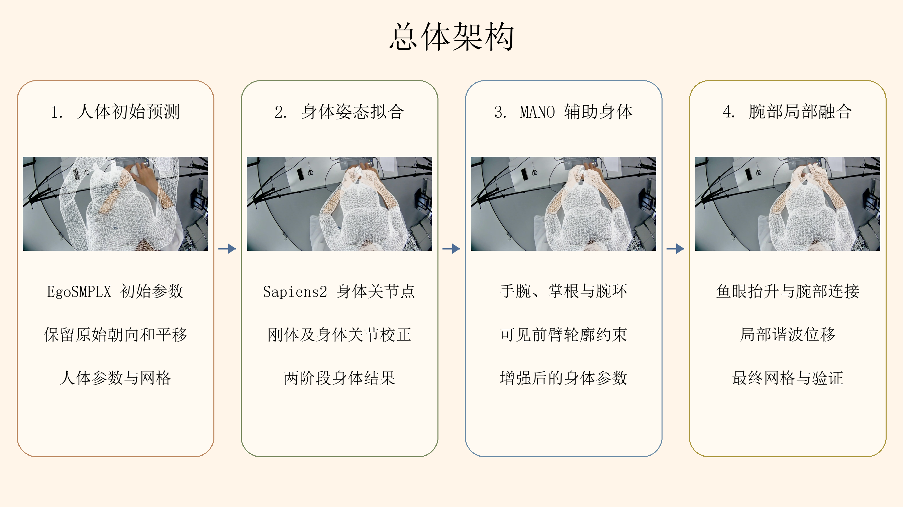
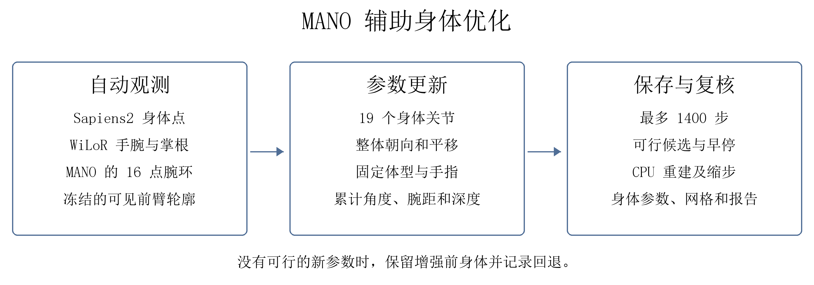
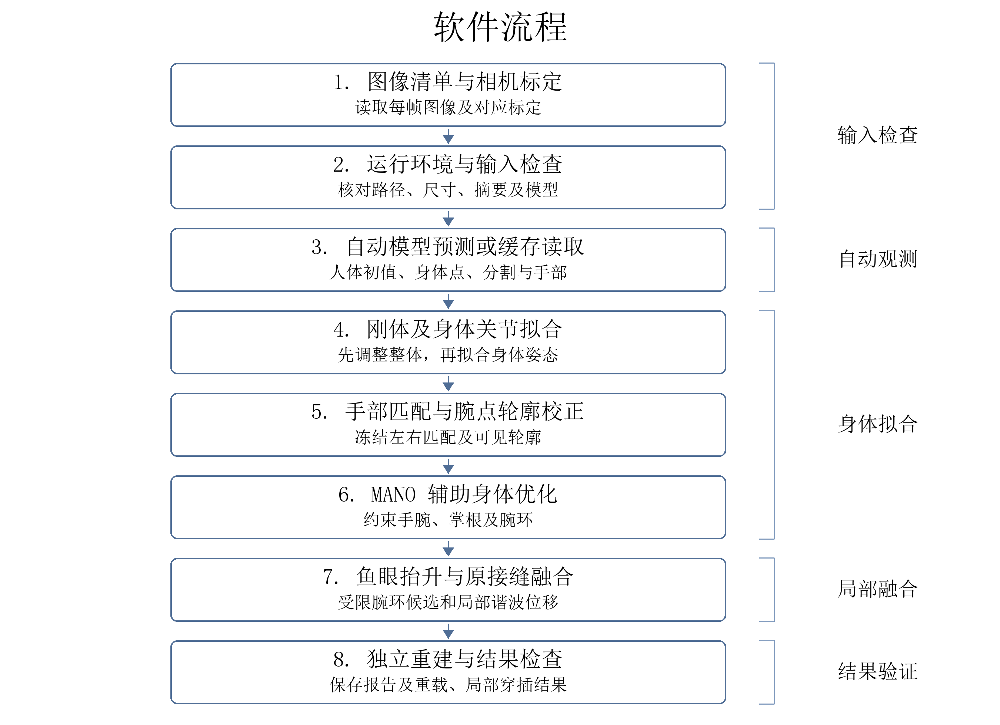
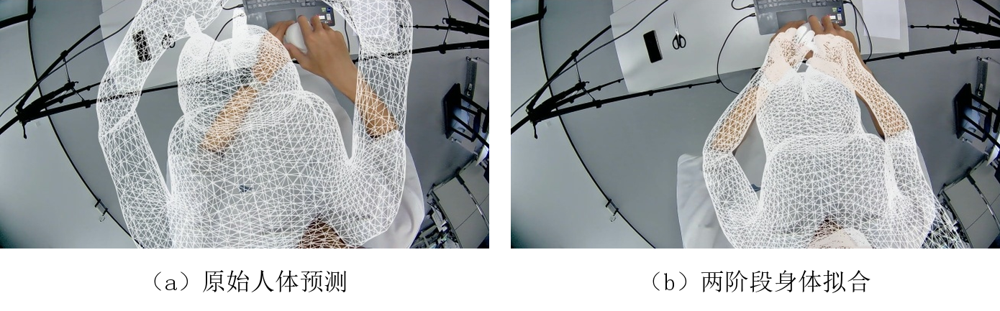
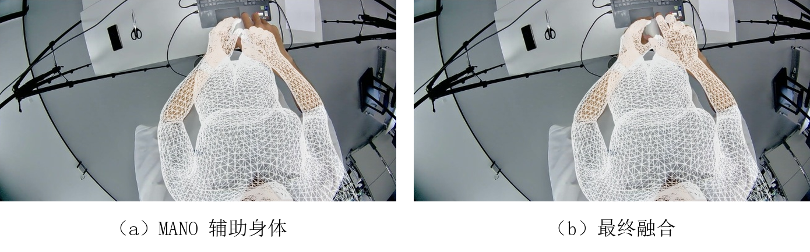
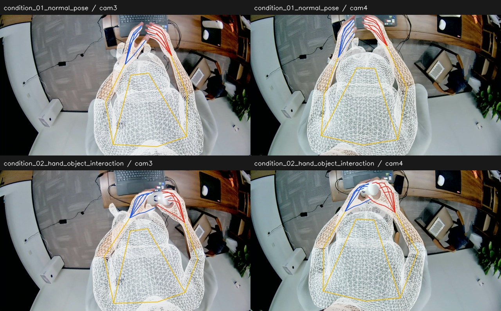
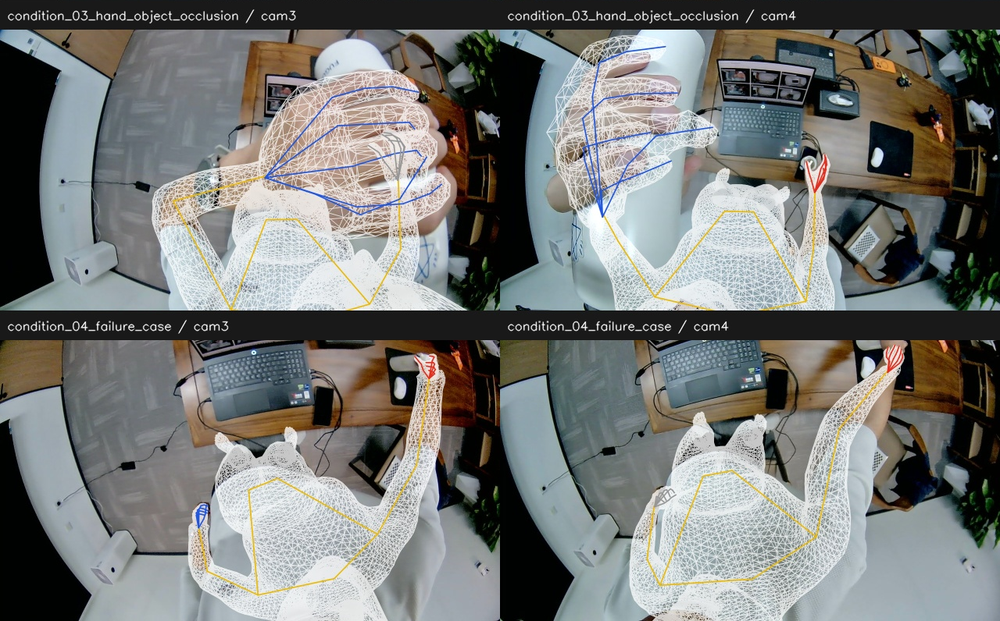

# 第一视角下视双目鱼眼相机估计身体姿态软件 V1.0

软件设计说明书

## 1. 软件概述

### 1.1 编写目的

身体姿态与双手动作的三维表达是虚拟化身驱动、第一视角交互分析和具身操作示范研究的基础。下视双目鱼眼图像能够记录使用者的近身动作，但畸变、遮挡和视野截断会影响身体与手部的估计结果，单独预测的身体和手部也难以直接形成可用的整体人体模型。

本软件面向下视双目鱼眼图像的人体姿态重建，以两路图像及各自的相机标定为输入，将人体预测、身体姿态校正、手部匹配与局部网格融合组织为可重复执行的处理流程。软件输出人体参数、三维网格和原图投影，并保留各阶段的检查记录，为姿态算法实验、动作数据分析和交互示范数据整理提供可复核的结果。

### 1.2 开发背景

下视鱼眼相机可以记录佩戴者的躯干、手臂及手部动作，但图像中存在较强的畸变，身体通常只有部分区域可见，近距离手部还会遮挡前臂和物体。直接使用人体预测网络时，网格的整体位置、手臂方向和手腕位置可能与图像不一致。单独的手部预测虽然能够描述手指姿态，却不能直接确定手部在人体网格中的位置。

软件以 EgoSMPLX 的人体预测作为初始结果，使用 Sapiens2 的身体关节点和部位分割校正身体，再利用 WiLoR 输出的 MANO 手部信息调整手腕与前臂。身体参数确定后，程序在腕部附近连接手部网格，尽量保持远离接缝的身体和手指形状。

### 1.3 适用范围

当前版本主要在具有 NVIDIA GPU 的 Linux 工作站或服务器上运行，支持图像清单输入、视频抽帧、自动预测、缓存预测复用、逐帧拟合和结果打包。当前处理入口要求输入图像为 1280×720，并检查标定文件中的尺寸是否一致。

双目相机的 cam3、cam4 图像分别使用各自的标定文件处理。当前算法按单幅图像拟合，没有实现左右视角的联合优化、双目三角化或跨帧姿态跟踪。视频抽帧记录帧号和近似时间，不能代替双目硬件同步。

部署人员负责准备运行环境、模型文件、输入数据和相机标定；使用人员负责检查投影与腕部外观；维护人员负责修改程序和执行回归测试。项目的开发和运行信息记录在登记信息及部署资料中。

### 1.4 术语定义

SMPL-X 是外部参数化人体模型，英文名称为 SMPL eXpressive，其中 SMPL 为 Skinned Multi-Person Linear Model。模型根据体型、姿态、整体朝向和平移等参数生成人体顶点与关节。本软件保存标准 SMPL-X 参数，也保存融合后的显式网格。

MANO 是外部参数化手部模型，英文名称为 Model with Articulated and Non-rigid defOrmations。WiLoR 的每个手部候选包含 778 个顶点和 21 个关节。MCP 指掌指关节，英文为 Metacarpophalangeal joint，身体增强阶段使用四个非拇指掌根点。

下文所称“自动观测”，是指由预测模型产生的身体点、手部点和分割结果。“原图坐标”以输入图像像素为单位；三维坐标以米为单位。“径向距离”是三维点到相机中心的距离，与相机坐标中的 z 分量不同。

RMSE 为 Root Mean Squared Error，即均方根误差。本文的点误差在原图二维坐标中计算。NPZ 是 NumPy 压缩数组文件，OBJ 是 Wavefront 三维网格文件，SHA-256 是用于核对文件内容的 256 位摘要算法。

### 1.5 参考资料

[1] EgoWholeView: Camera-Only Head-Mounted Capture of Body and Bimanual Hand Motion for Embodied Demonstrations. v17.3 论文源稿，申请人提供。

[2] cdh290718-oss. EgoSmplx 源代码仓库，https://github.com/cdh290718-oss/EgoSmplx，访问日期：2026-09-30。

[3] Na S, Noh S Y, Chang J Y. Egocentric Whole-Body Human Mesh Recovery with Prior-Guided Learning. ICIP, 2026. arXiv:2605.08606. 官方实现：https://github.com/naso06/EgoSMPLX。

[4] Potamias R A, Zhang J, Deng J, Zafeiriou S. WiLoR: End-to-end 3D Hand Localization and Reconstruction in-the-wild. CVPR, 2025. arXiv:2409.12259.

[5] Pavlakos G, Choutas V, Ghorbani N, et al. Expressive Body Capture: 3D Hands, Face, and Body from a Single Image. CVPR, 2019: 10975-10985.

[6] Romero J, Tzionas D, Black M J. Embodied Hands: Modeling and Capturing Hands and Bodies Together. ACM Transactions on Graphics, 2017, 36(6): 245:1-245:17.

[7] Khirodkar R, Wen H, Martinez J, et al. Sapiens2. ICLR, 2026. arXiv:2604.21681.

### 1.6 总体架构和设计思路

软件由输入控制、自动观测、身体拟合、手部匹配、MANO 辅助身体优化、局部网格融合和结果验证七个程序组组成。控制程序按照阶段顺序启动子进程，中间数据通过 JSON、NPZ 和图像文件传递。

每幅输入图像先与自己的相机标定绑定。人体网络提供初始 SMPL-X 参数，身体关节点用于校正整体位置和身体姿态；手部预测和可见前臂轮廓进一步约束手腕附近的形状。最后，程序重新连接手部网格，保存参数与网格，并独立读取这些文件检查重建结果。



图 1 中的图像取自 sample_01_cam3 的已有运行结果，表示人体初值、身体拟合、MANO 辅助身体和最终融合四个阶段。各阶段均保留原图投影，使用人员可以直接观察身体位置、手臂方向和腕部连接的变化。

标准身体阶段可以从 SMPL-X 参数重新生成网格。最终融合阶段在身体网格上替换手部并修改局部接缝，重建时还需要手部预测、标定、匹配关系、分割标签和冻结轮廓目标。仅保存一组 SMPL-X 参数不能恢复最终融合网格。

## 2. 运行环境

### 2.1 硬件环境

完整模型预测需要支持 CUDA 的 NVIDIA GPU。已有部署记录使用单张 80 GB 显存的 GPU，该配置是已使用的环境，不表示软件必须占用 80 GB 显存。实际占用受模型、图像尺寸和缓存方式影响。

刚体和两阶段身体拟合主要在 CPU 上运行，默认使用两个计算线程。腕点、轮廓和 MANO 辅助身体优化优先使用 GPU，局部谐波位移由 CPU 上的稀疏求解器计算。输出目录需要保存原图、预测缓存、四阶段参数、网格和报告，批量处理时应预留相应磁盘空间。

### 2.2 软件环境

控制程序使用 Linux、Python、NumPy、OpenCV 及标准进程管理接口。三个外部模型分别在各自的 Python 环境中执行，避免模型依赖相互影响。表 1 列出仓库 runtime_versions.json 中记录的环境。

表 1 已部署的模型运行环境

| 环境 | Python | PyTorch | 主要用途 |
| --- | --- | --- | --- |
| 身体环境 | 3.8.20 | 1.12.1，CUDA 11.3 | EgoSMPLX、SMPL-X 与几何计算 |
| 姿态与分割环境 | 3.10.0 | 2.7.0+cu128 | Sapiens2 身体点与部位分割 |
| 手部环境 | 3.10.0 | 2.7.0+cu128 | WiLoR 手部检测与 MANO 预测 |

SciPy 用于局部接缝的稀疏线性方程求解。SMPL-X、MANO、预测网络权重和已适配的外部仓库需另行准备；安装根目录依赖后，还应按 DEPLOYMENT_zh.md 完成后端接口检查。

## 3. 软件功能

### 3.1 输入检查与任务建立

程序读取运行配置和图像清单，解析路径及环境变量，检查文件是否存在、帧标识是否重复、图像是否与标定尺寸一致。选择缓存方式时，还会检查预测文件与原图的摘要、尺寸和坐标声明。检查通过后，控制器建立逐帧任务。

### 3.2 自动模型预测

软件调用 EgoSMPLX 获取人体初始参数，调用 Sapiens2 获取 308 个姿态点和 29 类部位分割，调用 WiLoR 获取手部候选。模型输出经坐标恢复后，以原图像素为单位保存，供后续拟合使用。

### 3.3 身体与手部处理

身体拟合先调整整体朝向和平移，再调整 19 个身体关节。随后，程序把手部候选分配给左右身体手腕，执行腕点校正和可见前臂轮廓拟合。在此结果上加入 MANO 手腕、掌根和腕环目标，继续优化身体参数。

融合程序将手部预测转换到鱼眼相机坐标，在腕部局部邻域内连接网格。程序限制腕环尺度、边长、面积、法向和深度；不满足要求的候选不会替换已有结果。

### 3.4 结果保存与检查

程序保存四阶段参数和网格，绘制原图投影，生成静态 HTML 对比页及运行摘要。独立重载检查核对保存参数、NPZ 网格和 OBJ 是否一致，局部穿插检查另行记录腕部邻域与其他表面的交叉情况。用户可以在运行完成后生成 ZIP 结果包。

### 3.5 功能与程序的对应关系

七个程序组的文件组成见第 4 章。表 2 中“√”表示该程序组直接实现或参与相应功能，空白表示不承担该项处理。

表 2 功能与程序组对应关系

| 功能 | M1 | M2 | M3 | M4 | M5 | M6 | M7 |
| --- | --- | --- | --- | --- | --- | --- | --- |
| 配置、检查和抽帧 | √ |  |  |  |  |  | √ |
| 自动模型预测 | √ | √ |  |  |  |  | √ |
| 身体姿态拟合 | √ |  | √ |  |  |  | √ |
| 手部匹配与轮廓 | √ |  | √ | √ |  |  | √ |
| MANO 辅助身体 | √ |  | √ | √ | √ |  | √ |
| 腕部局部融合 | √ |  | √ | √ | √ | √ | √ |
| 验证、报告和打包 | √ |  | √ |  |  | √ | √ |

## 4. 软件核心模块设计

### 4.1 输入与流程控制

本程序组标识为 M1，主要文件为 __main__.py、configuration.py、sampling.py、pipeline.py 和 profiles.py。命令行入口读取配置后，依次执行输入检查、模型观测、逐帧拟合、参考阶段处理和结果汇总。计算任务按帧顺序执行，模型通过子进程启动，任务结束后退出。

输入包括配置文件路径、图像清单、模型解释器路径及缓存、续跑选项。配置包含 manifest、output、paths、gpu、fitting 和 pipeline_profile。帧标识只允许安全的字母、数字、下划线和连字符，并要求唯一。拟合步数必须为正整数，布尔值不能作为步数使用。

控制器为每帧生成任务 JSON，把配置、帧记录和输出目录传给 frame 程序。任务状态分别记录为运行中、进度更新和完成；子进程的标准输出与错误输出合并保存到日志，非零退出码会中止对应处理。Linux 文件锁用于阻止两个任务同时写入同一目录。

续跑检查使用配置、输入、缓存和核心代码的 SHA-256 摘要。摘要和逐帧产物都一致时复用已完成帧；内容发生变化时要求使用新目录。未完成或损坏的帧目录先保留，再重新计算，恢复粒度为帧和阶段，不是优化器的任意迭代步。

视频抽帧逐次解码图像，在等分区间内选择中点索引。总帧数为 n、抽取数量为 K 时，第 k 个索引为 min(n−1, floor((k+0.5)n/K))。输出为 PNG、清单、零基帧号和近似时间；已有抽帧目录拒绝覆盖。

控制器在内存中保留清单、摘要及结果记录，计算量较大的模型和网格由子进程管理。程序注释说明路径展开、续跑摘要和失败目录保留的原因。配置与控制逻辑修改后，应检查变量展开、重复标识、未知流程、非法步数、目录锁冲突及损坏文件续跑；相关单元测试位于 tests/test_core.py 和 tests/test_guided_profile.py。

### 4.2 自动观测与模型适配

本程序组标识为 M2，由 egosmplx_predict.py、sapiens_pose.py、sapiens_seg.py 和 wilor_predict.py 实现。输入为原图、对应标定、模型配置和权重文件，输出为人体 NPZ、身体点 JSON、分割数组和手部预测。缓存路线直接使用已有观测，不执行本组的网络预测。

EgoSMPLX 适配器采用已部署后端的连续去畸变与 aspect_pad 输入方式，保留网络给出的整体朝向和平移。身体预测必须能够唯一对应相机佩戴者，否则程序报告错误。Sapiens2 按官方姿态配置恢复关键点坐标，分割 logits 先恢复到原图尺寸，再计算概率与类别标签。

姿态文件保存 308 个点的名称、x、y 和 score，以及图像尺寸、摘要和坐标范围。分割标签形状为 H×W，概率形状为 29×H×W，以 float16 保存。WiLoR 每个候选保存左右手属性、置信度、21 个关节点、778 个顶点、相机平移及实际焦距。没有检测到手时保存零候选文件，后续保持标准人体手部。

模型在各自 GPU 环境中加载和执行。Sapiens2 使用 bfloat16 自动混合精度，解码及尺寸恢复使用 float32；权重按严格加载方式检查，并核对摘要。模型及输入张量位于 GPU，解码后的文件数据写入 CPU 数组和磁盘缓存。分割概率按帧保存，避免进入最终公开结果包。

接口注释重点说明图像裁剪恢复、左右镜像、焦距和原图坐标，不能把检测 score 当作经过校准的准确率。部署或权重更新后，应进行单帧原生测试，检查严格加载、尺寸、点数、空手检测和错误权重拒绝。已有预测可能受遮挡、畸变和截断影响，这些误差会传递到后续拟合。

### 4.3 相机投影与身体姿态拟合

本程序组标识为 M3，公共相机函数位于 camera.py 和 projection.py，身体拟合位于 body_common.py、body_rigid.py 和 body_pose.py。frame 程序调用这些函数，其他手部和验证程序也使用同一组投影接口。

标定文件包含 polynomialC2W、polynomialW2C、intrinsic 或 image_center，并可提供 affine、c/d/e 和 camera_axis_transform。程序检查图像尺寸、仿射矩阵和轴变换；仿射行列式退化或轴变换无效时停止处理。三维坐标采用米，投影结果采用原图像素。

对于轴变换后的相机点 (x, y, z)，先计算 r=√(x²+y²) 和 θ=atan(−z/r)，再通过逆多项式得到径向像素距离 ρ=Σaₖθᵏ。平面坐标为 x′=xρ/r、y′=yρ/r；仿射映射为 u=cx′+dy′+u₀、v=ex′+y′+v₀。反投影先解除仿射映射，再由正向多项式求射线，归一化后乘以径向距离。高阶多项式使用 FP64 Horner 计算，以减少数值不稳定。

身体拟合从 Sapiens2 的 13 个身体候选点中选择有限、位于图内且 score≥0.3 的点，至少需要四个有效点。第一阶段只调整 global_orient 和 transl，旋转围绕骨盆合成。默认执行 1800 次 Adam 更新，整体旋转增量不超过 60°，平移 z 范围为 0.05～3 米。

第二阶段默认执行 1600 步，开放 19 个身体关节，并允许小幅整体调整。体型、手指、双脚及面部参数保持不变。身体点损失使用归一化像素残差和 Smooth L1，并加入姿态、平移、朝向、腕距和深度约束。程序保存满足约束的最佳候选，最终网格 z 不低于 0.02 米，腕距不低于刚体初值的 85%，整体增量不超过 8°。

表 3 身体关节的轴角增量上限

| 关节部位 | 上限 | 说明 |
| --- | --- | --- |
| 髋、膝、踝 | 18°、22°、14° | 相对刚体阶段的姿态 |
| 三段脊柱 | 10°、10°、12° | 各段分别限制 |
| 颈、头 | 各 12° | 限制轴角向量的范数 |
| 锁骨、肩、肘、腕 | 15°、28°、25°、15° | 不是每个旋转轴分别取上限 |

每次参数变化后，canonicalize 调用模型重新生成顶点、关节及投影。输出包括刚体结果、身体参数、OBJ、投影图、损失历史和约束记录。CPU 内存保存当前参数、网格、梯度和最佳候选，模型权重不参与训练。

投影代码的注释说明骨盆旋转中心、径向距离和高阶多项式精度。修改本组后，应运行 tests/test_projection.py，检查投影一致性、梯度、径向反投影和奇异标定拒绝，并核对固定参数与保存后的几何。自动点错误或初值偏差过大时，有限步拟合仍可能失败。

### 4.4 手部匹配与腕部轮廓校正

本程序组标识为 M4，主要文件为 matching.py、reference/wrist_refine.py、reference/silhouette.py、reference/contour_refine.py、reference/contour_refine_strong.py 和 reference/select_candidates.py。程序接收身体结果、手部候选、自动肘腕点及部位分割，输出匹配关系、校正身体和冻结轮廓目标。

左右手采用一对一分配，同一检测不能用于两侧。候选置信度至少为 0.25，腕点到身体锚点的距离不超过 150 像素，至少有 12 个有限且位于图内的手点。锚点优先使用可信的 Sapiens2 手腕，缺失时使用身体手腕。

候选代价由腕点距离、左右手不一致惩罚和置信度组成：C=腕点距离+45×左右不一致+20×(1−confidence)。未匹配代价为 180。程序枚举左右组合，选择总成本最低且不复用检测的组合，并保存匹配索引及锚点来源。缺少手的一侧保持标准 SMPL-X 手部。

腕点校正先运行 500 步，再运行 400 步主动约束投影。前臂轮廓沿肘到腕的方向取横截面，使用六类身体分割的并集和可见端点筛选有效截面。普通与较强轮廓分支分别计算，结果按原有约束选择；身份和轮廓支持集随后冻结，供身体增强及最终融合使用。

本阶段限制固定参数、累计角度、腕距、深度和身体点退化量，不根据分割的左右标签重新分配手部。GPU 保存可微目标与距离图，候选和诊断写入 JSON。注释说明阈值的像素单位、分割并集及遮挡截面的排除方法。匹配测试覆盖单候选防复用、低置信和空候选；轮廓测试应包含断裂分割、缺少肘点和双手靠近样例。

### 4.5 MANO 辅助身体优化

本程序组标识为 M5，核心文件为 reference/guided_body.py。fit 函数从腕点与轮廓校正后的身体继续优化，不重新初始化人体，也不改变已经确定的左右匹配。输入包括前置身体、原始刚体结果、WiLoR 预测、轮廓目标、分割标签及重建配方。

程序保留体型、骨长、手指、双脚和面部参数，开放原有 19 个身体关节及整体朝向和平移。目标包含 Sapiens2 身体点、WiLoR 手腕、四个非拇指掌根、MANO 的 16 点腕环以及可见前臂轮廓。MANO 目标使用其原生投影，不预先平移到当前身体手腕。



组合损失为 L=4L身体+4L手腕+L掌根+5L腕环+1.5L轮廓+L先验。像素残差使用阈值为 20 像素的 Huber 损失，再按 10000 归一化。身体点按置信度平方加权，并加入 0.15 倍平方误差项。姿态、平移和整体朝向的先验限制参数偏离原始身体。

Adam 默认最多更新 1400 步。关节、整体朝向和平移的学习率分别为 0.002、0.0008 和 0.0015。连续 200 步最佳目标改善未超过 1e-7 时停止。每次更新后检查累计角度、腕距和深度，违反约束时向前一步回退，只保存可行且目标改善的候选。

身体点 RMSE 上界取“原第二阶段 RMSE+5 像素”和“增强前 RMSE+0.5 像素”中的较小值。结束后，CPU 重新计算网格与约束；必要时沿增强前参数方向逐次缩步，最多 30 次。仍不可行时保留增强前身体，并在 optimization.json 中记录回退。

输出为 guided_body 的标准参数、OBJ、投影图和优化记录。内存主要保存关节增量、刚体增量、冻结目标、上一步及最佳候选。objective、alpha 和 rejected 等字段说明损失、缩步比例及拒绝原因。无匹配手时跳过本阶段；数值修改后应验证固定参数、早停、回退以及两帧迁移对照，不能只根据目标下降判定全部误差改善。

### 4.6 鱼眼手部抬升与局部接缝

本程序组标识为 M6，由 lift.py、fusion.py、topology.py、reference/contour_seam.py 和 reference/guided_fuse.py 实现。guided_fuse 调用原有 contour_seam.build，在增强身体上重新连接手部。输入为身体参数、MANO 顶点、标定、冻结匹配、标签和轮廓目标；输出为显式网格、接缝报告和完整重建配方。

WiLoR 手部先在针孔相机中投影，整体移动到对应身体腕点的像素位置。每个点的径向距离由身体腕距加上 MANO 相对根点距离得到，最低裁到 0.05 米，再乘以鱼眼标定射线，转换为相机坐标。实际焦距和图像尺寸来自预测文件，未知缓存不能直接套用已有样例的焦距。

程序使用 16 个共享腕界点连接身体和手部。以同体型中性腕环为尺度参考，限制对齐角度、移心和缩放，构造 29 个有限候选。候选的局部位移作用于腕部附近的身体与手部环层，外围边界为零位移，远处身体和手指保持原有几何。

局部位移通过稀疏拉普拉斯方程求解。自由顶点 i 满足 degree(i)dᵢ−Σ自由邻点dⱼ=Σ已知邻点dⱼ，三个坐标分别计算。候选需满足身体边长比 0.70～1.40、面积比 0.4～2.2、腕半径比 0.85～1.15、法向不反转和最小 z≥0.02 米；该侧手部 RMSE 不超过基线加 3 像素。

候选评分结合手部边长变化、手点误差、法向反转和轮廓误差。只有合格且评分优于基线的候选被采用，否则保留基线。拓扑检查要求共享腕界的每条边具有方向相反的相邻面；网格点回归器再从最终顶点计算手关节，绘图时不把目标点当作预测结果。

稀疏矩阵和局部顶点在 CPU 中计算，逐侧候选、位移和拒绝原因写入 seam_report.json。程序注释说明腕环索引、径向抬升和局部支持范围。测试应检查边界连接、固定区域、违规候选回退和重建误差。遮挡和错误身体腕位仍可能产生鼓包或穿插，拓扑连接正确也不表示表面完全自然。

### 4.7 验证与结果导出

本程序组标识为 M7，主要文件为 frame.py、reference/pipeline.py、reference/finalize.py、reference/surface_audit.py、render.py、report.py、package.py 和 io.py。程序接收各阶段参数、显式网格、重建资产和逐帧记录，输出验证 JSON、对比图、HTML、运行摘要和 ZIP 包。

标准身体由保存的参数重新计算，融合网格由保存的身体、手部、标定和配方重新构建，再与 NPZ 和 OBJ 比较。最终顶点绝对差不超过 1e-5 米，面片须一致，文件摘要须匹配。重载失败时不记录可信完成状态。

局部穿插检查对接触指定前臂支持集的三角形进行筛选，排除共享顶点的面，再执行非相邻、非共面三角形的内部交叉检查。结果写入 local_surface_accepted，取 true、false 或未检查时的 null，与重载 passed 分开保存。

二维 RMSE 按每个有效点的欧氏距离计算：RMSE=√(Σ[(uᵢ−u目标ᵢ)²+(vᵢ−v目标ᵢ)²]/N)。批量结果先合并全部点的平方误差再开方，不平均各帧 RMSE。没有匹配手时，手误差记录为 null。身体参考为 Sapiens2，手部参考为 WiLoR，均为自动预测。

报告使用本地图像和相对路径，不加载远程脚本。当前流程显示四列，历史流程显示三列，不同流程的记录不能混合汇总。结果包仅在运行完成且产物核对通过后建立，写入成员摘要并执行 ZIP CRC 检查；已有同名包拒绝覆盖。

汇总时内存保存逐帧记录和缩略图，大任务可以分批处理。注释说明自动点误差、重载一致性和局部表面检查的区别。测试应覆盖破坏参数、修改 OBJ、摘要变化、已存在 ZIP、空手误差和“重载通过但表面失败”的记录，防止不同检查结果被合并为一个通过状态。

## 5. 技术特点

### 5.1 使用同一套鱼眼投影

身体拟合、手部抬升、原图绘制和误差计算使用同一份标定及坐标约定。网络输出恢复到原图后再参与优化，减少裁剪图、针孔图和鱼眼图之间混用坐标的问题。

### 5.2 分阶段调整身体与腕部

整体位置、身体关节、手腕轮廓和局部网格分别处理。体型与手指等固定参数在身体优化中保持不变，腕部接缝的自由顶点也限定在局部范围内。阶段间保留参数和诊断文件，出现异常时可以检查从哪一步开始偏离。

### 5.3 保存可重新构建的结果

标准身体参数和最终融合资产分别保存。重载程序重新执行几何计算，而不是仅检查文件是否存在。局部穿插另行记录，使文件一致性和表面问题都有可查的结果。

## 6. 软件流程

### 6.1 完整运行流程

用户完成配置后，控制器先核对输入与运行资源，再调用模型预测。每帧依次进行刚体拟合、身体关节拟合、手部匹配、腕点与轮廓校正、MANO 辅助身体优化以及原接缝融合。阶段输出保存后，程序执行重载、拓扑和局部表面检查，最后生成报告与运行摘要。

### 6.2 运行方式与模块组合

原生运行使用 M1 至 M7，包括三个外部模型环境。缓存运行跳过 M2，仍需身体后端、同图观测及分割文件。视频抽帧只调用 M1 的采样功能，产生图像和清单后另行运行；打包主要使用 M7，复核已完成运行的文件。

当前默认配置为 mano_guided_original_seam_20260929_v1。历史 session_hand6_full_pipeline_20260926_v1 保留三阶段结果，不包含新增 MANO 身体阶段。切换配置、输入或代码后，应使用新输出目录。

### 6.3 运行控制与时间记录

控制器按顺序启动阶段，保存子进程命令、日志和退出码。用户通过 check、run、--cached-predictions 和 --resume 选择运行方式，具体命令见第 8 章。任务以配置文件和文件锁确定写入范围。

运行时间保存在 worker 的 inference_seconds、elapsed_seconds 和日志时间戳中。网络预测受模型加载、GPU 和输入尺寸影响，身体优化受迭代步数与 CPU 影响，谐波求解和导出受局部矩阵、网格及磁盘速度影响。当前没有统一的端到端速度测试，不把单阶段记录作为整套流程的耗时。

完整运行顺序见图 3。模型预测属于原生路线，缓存路线从已有的自动观测进入身体拟合，其后的身体增强、接缝和验证顺序相同。没有有效手匹配的帧保留标准手部，并跳过相应手部增强。



## 7. 数据输入输出

### 7.1 输入数据

图像清单的每条记录包含 id、image 和 calibration，可提供 camera 及 predictions。id 对应逐帧输出目录，image 指向原图，calibration 指向该侧相机标定。缓存预测按 egosmplx、sapiens、segmentation 和 wilor 分类指定。

模型资源包括 SMPL-X、MANO、EgoSMPLX 配置与权重、Sapiens2 姿态和分割权重、WiLoR 配置、检测器和手部权重。具体路径在运行配置中填写，示例路径需替换为部署机器上的实际位置。

### 7.2 逻辑数据结构

表 4 列出主要结构及尺寸。模型顶点和面片数量由实际部署的模型资源确定；不能把其他后端的维度直接写成固定值。

表 4 主要数据结构

| 数据项 | 字段或结构 | 类型及范围 |
| --- | --- | --- |
| 帧记录 | id、image、calibration、camera | 唯一标识与文件路径 |
| 相机标定 | 多项式、中心、仿射及轴变换 | 有限系数，图像尺寸一致 |
| 身体参数 | body_pose、betas、global_orient、transl | body_pose 为 21×3，整体参数为三维向量 |
| 身体观测 | name、x、y、score | 308 点，原图像素，拟合选取 13 个候选 |
| 部位分割 | labels、probabilities、class_ids | H×W uint8；29×H×W float16 |
| 手部候选 | 左右属性、置信度、相机信息、点和顶点 | 每手 21 点、778 顶点，可为零候选 |
| 融合网格 | vertices、faces、hand_joints、映射 | V×3 顶点，F×3 面片索引 |
| 重建配方 | matches、轮廓目标、支持集和摘要 | 与身体、手部和标定共同重建 |
| 验证记录 | passed、surface、点误差、摘要 | 米与像素分别保存，缺失值为 null |

### 7.3 文件组织与存储

JSON 使用 UTF-8，保存配置、匹配、状态和诊断；NPZ 保存结构化数组，读取时禁用 pickle；OBJ 保存显式顶点和面片。程序拒绝非有限数值，JSON 先写临时文件再替换。图像与预测通过 SHA-256 绑定。

分割概率按 29×720×1280 个 float16 元素计算，未压缩约 51 MiB/帧，标签约 0.88 MiB/帧。float32 的中间概率约占 102 MiB，还需考虑模型、图像和优化张量。最终结果包保留分割标签及冻结目标，不包含模型权重和完整概率缓存。

原始图像可能包含人员和场景信息，目录访问权限由部署系统管理。共享结果前应检查图像、日志和路径；当前程序不提供账户权限、自动脱敏或加密打包。

```text
运行目录/
├─ observations/           图像和自动观测
├─ jobs/                   逐帧任务
├─ frames/帧标识/
│  ├─ raw/                 原始人体
│  ├─ body/                两阶段身体
│  ├─ guided_body/         MANO 辅助身体
│  ├─ fused/               融合网格与重建资产
│  └─ validation.json      逐帧验证
├─ reference/              中间优化及接缝结果
└─ 报告、状态、摘要和日志
```

### 7.4 数据与程序的关系

表 5 使用“读”“写”和“读写”表示程序组对数据的主要访问方式。标定和自动观测在后续阶段保持来源一致，融合配方供独立重建再次读取。

表 5 数据与程序组访问关系

| 数据 | M1 | M2 | M3 | M4 | M5 | M6 | M7 |
| --- | --- | --- | --- | --- | --- | --- | --- |
| 图像与标定 | 读 | 读 | 读 | 读 | 读 | 读 | 读 |
| 自动观测 | 读 | 写 | 读 | 读 | 读 | 读 | 读 |
| 标准身体 |  | 写 | 读写 | 读写 | 读写 | 读 | 读 |
| 匹配及轮廓 |  |  |  | 写 | 读 | 读 | 读 |
| 融合网格与配方 |  |  |  |  |  | 写 | 读 |
| 验证及报告 | 读写 |  |  |  |  |  | 读写 |

### 7.5 用户接口与程序接口

用户接口为命令行，check 回答预检查状态、帧数和检查范围，run 保存进度与完成信息，sample 输出图像清单，package 返回包路径、摘要和成员数。

控制器以参数列表启动三个 Python 解释器，使用 CUDA_VISIBLE_DEVICES 指定 GPU，不通过拼接 shell 字符串解释模型参数。frame 通过 --job 接收逐帧 JSON；后续 reference 程序通过清单、NPZ 和 JSON 读取阶段结果。外部模型接口由 backend_contract.json 约定，公共几何由 bootstrap.py、support.py 和相机函数提供。

## 8. 使用说明

### 8.1 运行配置

参考配置为 configs/pipeline.example.json，图像清单为 configs/frames.example.json。首次使用时填写三个模型解释器、外部仓库、权重和输出目录。缓存运行可使用 frames.cached.example.json 的字段组织预测路径。

```json
{
  "manifest": "frames.example.json",
  "output": "${PACKAGE_ROOT}/outputs/example_run",
  "gpu": "0",
  "pipeline_profile": "mano_guided_original_seam_20260929_v1",
  "fitting": {
    "rigid_steps": 1800,
    "pose_steps": 1600,
    "mano_guided_steps": 1400
  }
}
```

相对路径按配置或清单所在目录解析，PACKAGE_ROOT 指向项目根目录，其他变量从运行环境读取。配置中的模型路径和摘要占位值必须替换后才能使用。

表 6 主要运行参数

| 参数 | 默认值 | 用途 |
| --- | --- | --- |
| gpu | 0 | 指定模型使用的 GPU |
| rigid_steps | 1800 | 刚体拟合更新次数 |
| pose_steps | 1600 | 身体关节拟合更新次数 |
| mano_guided_steps | 1400 | MANO 辅助身体更新上限 |
| pipeline_profile | 当前默认流程 | 选择阶段顺序与输出方式 |
| cached_wilor_focal_px | 需按实际缓存确定 | 补充旧手部缓存的真实焦距 |

### 8.2 环境与输入检查

```shell
python -m egosmplx_pipeline check --config configs/pipeline.example.json
```

check 核对路径、清单、标定和配置。原生路线还需在正式运行时通过模型严格加载；缓存路线需验证同图观测。预检查通过不表示模型输出或人体姿态已经合格。

### 8.3 原生运行与缓存运行

```shell
python -m egosmplx_pipeline run --config configs/pipeline.example.json
```

原生运行从图像开始调用三个预测模型，再执行身体拟合、手部处理和验证。只复用已保存预测时，在同一命令后增加 --cached-predictions；图像清单仍须提供完整、对应原图的缓存文件。

### 8.4 视频抽帧

sample 命令使用 --video、--calibration、--camera、--count 和 --output，分别指定视频、标定、相机名称、帧数和新目录。左右视频分开抽帧，再将记录合并到清单。count 为正整数，输出帧号和近似时间供后续核对。

### 8.5 续跑与打包

再次运行已有任务时增加 --resume，程序核对摘要及产物，复用完整帧或重算损坏帧。修改配置、模型观测或代码后，应使用新目录，避免把旧结果与新任务混合。

```shell
python -m egosmplx_pipeline.package --run outputs/example_run --archive result.zip
```

打包前应确认运行完成、逐帧验证和文件摘要一致。ZIP 保存阶段结果及重建所需资产；已有 result.zip 不覆盖，需要改用新包名。

### 8.6 结果查看

四阶段对比页依次显示原始人体、Sapiens2 身体拟合、MANO 辅助身体和最终融合。图像用于查看位置与形状，JSON 用于核对参数、误差和拒绝原因。身体增强记录位于 guided_body 和 reference/guided，接缝及重载记录位于 fused。

## 9. 异常处理与恢复设计

### 9.1 异常情况与处理方法

表 7 列出常见异常。程序保留失败记录和日志，恢复时先检查输入及资产，不通过放宽约束强行生成结果。

表 7 异常情况及处理方法

| 异常情况 | 判断方式 | 处理方法 |
| --- | --- | --- |
| 路径、帧标识或步数错误 | 配置检查报告 ValueError | 修改配置后重新检查 |
| 图像与标定尺寸不符 | 尺寸检查失败 | 使用对应原图及标定，不缩放套用 |
| 缓存缺失或原图摘要不同 | 文件及摘要核对失败 | 补充同图缓存或改用原生路线 |
| 权重或模型接口不匹配 | strict load 或 worker 失败 | 检查版本、配置、权重和日志 |
| 有效点不足或分布退化 | 自动点筛选及刚体检查失败 | 保留问题帧，检查原始观测 |
| 优化更新违反限制 | 深度、角度、腕距检查失败 | 拒绝更新、缩步或回退 |
| 数值非有限 | 数组、目标或梯度检查失败 | 中止并保留诊断 |
| 文件无法一致重建 | 重载、OBJ 或面片比较失败 | 不记录可信完成，检查重建链 |
| 局部穿插 | local_surface_accepted 为 false | 保留几何及问题面片，供检查 |
| 已有目录、锁或变更续跑 | 目录与指纹检查失败 | 使用新目录或核验原任务续跑 |

### 9.2 日志和状态记录

总控制器保存阶段、子进程命令和退出码，各模型及几何程序保存自己的执行输出。逐帧 validation.json 记录输入摘要、误差和状态，optimization.json 记录优化历史及回退，seam_report.json 记录候选与接缝限制，geometry_validation.json 和 reload_validation.json 记录表面及重载结果。

出现问题时，先从控制器日志确定停止阶段，再检查对应输入和模型日志，最后核对阶段参数、配方与约束报告。表面失败和重载失败分别处理，不能只看总状态判断几何质量。

### 9.3 恢复与降效处理

已有完整帧通过摘要和重建检查后，可以在相同任务下复用。损坏或未完成目录保留后重算；用户可以另行备份原图、参数和结果包，当前程序没有自动异地备份。

资源受限时可按较小清单分批处理，或复用核验过的预测缓存。缓存路线仍需要身体后端，部分后续优化可在支持的 CPU 路径执行，不能仅凭根目录依赖代替完整模型部署。

## 10. 测试与运行结果说明

### 10.1 测试内容

配置测试检查相对路径、环境变量、唯一标识、流程选择和步数；投影测试检查 NumPy 与可微投影的一致性、梯度、径向反投影及退化标定；匹配测试检查候选不复用、空手和低置信结果。

几何测试检查固定参数、累计角度、深度、腕距、候选回退及局部边界。结果测试检查参数重新生成、NPZ 与 OBJ 一致、穿插标志、空手误差、四阶段报告和 ZIP CRC。修改相应程序后，应在部署环境中执行单帧验证，再检查批量结果。

### 10.2 单帧完整路线结果

仓库 current_controller_validation.json 记录 sample_01_cam3 使用当前默认配置的缓存运行。该帧具有两只匹配手、13 个身体点和 42 个手点，完成两阶段身体、腕点、轮廓、MANO 辅助身体、原接缝和验证。



图 4 左侧为原始人体预测，右侧为 Sapiens2 两阶段身体拟合。图像可用于观察人体整体位置及手臂调整；像素误差仍需结合保存的目标和统计文件核对。



图 5 左侧为 MANO 辅助身体，右侧为增强身体上的原接缝融合。该帧最终身体点 RMSE 为 24.19 像素，手点 RMSE 为 11.74 像素，重载和局部穿插检查通过。既有记录还包含续跑、15 项测试和 76 个 ZIP 成员摘要及 CRC 检查。此次运行复用了预测缓存，没有重新执行神经网络预测。

### 10.3 四场景八帧结果

当前另一组验证数据包含正常姿态、手物交互、手部遮挡和失败样例四类场景，每类包含 cam3、cam4 两幅图，共八帧、14 只匹配手。身体参考为同一批 Sapiens2 自动点，手部参考为 WiLoR 自动点。该组与前述单帧不是同一统计集合。

表 8 八帧自动目标点误差

| 统计项目 | 增强前基线 | 当前结果 | 有效点数 |
| --- | --- | --- | --- |
| 身体全部点 RMSE | 41.45 px | 37.52 px | 100 |
| 排除鼻点的身体 RMSE | 40.55 px | 38.57 px | 94 |
| 肩、肘、腕 RMSE | 53.88 px | 51.71 px | 47 |
| 手部 RMSE | 14.91 px | 17.62 px | 294 |

身体点贴合有所改善，手点误差则增加。八帧独立重载均通过，局部穿插检查通过四帧。自动点并不是人工真值，这些数值用于比较同一组目标的贴合程度，不能直接解释为人体三维精度。



图 6 上行为正常姿态，下行为手物交互，每行左侧为 cam3，右侧为 cam4。图中白色线框表示最终网格，彩色点线用于对照自动观测。该四帧局部穿插检查通过。



图 7 上行为手部遮挡，下行为失败样例。靠近相机的手部、局部遮挡及不准确的腕位会影响网格形状，该四帧局部穿插检查未通过，问题结果保留在仓库中供分析。

### 10.4 验证记录的范围

八帧误差来自 current_body_rmse.json 和 current_body_rmse.csv，迁移及重载结果来自 guided_migration_validation.json。已有记录执行了八帧原接缝重建和两帧新增优化重跑，不能写成八帧全部上游网络重新运行。

历史 session_hand6 归档另有八帧、16 只手，身体和手点分别为 100、336 点；旧流程身体 RMSE 为 31.96 像素，手部为 4.41 像素，没有新增 MANO 身体阶段。它与当前四场景八帧的输入、目标点数和流程不同，不与表 8 合并。

本章的结果图和误差来自仓库已有运行记录。论文参考资料 [1] 的 UnrealEgo-RW、DexYCB 和 HO3Dv3 实验使用双视角参数融合及各自的数据集协议，其 PA-MPJPE、PA-MPVPE 和角加速度指标不与本章二维自动目标 RMSE 合并统计。重建在同一部署环境中逐值一致的记录，也不能保证不同硬件和依赖版本下逐位一致。

## 11. 当前版本限制

### 11.1 自动观测与遮挡

身体点、分割和手部预测可能产生误检。单幅鱼眼图像中的深度和遮挡具有歧义，二维目标贴合较好时，三维形状仍可能不正确。当前八帧的手部误差未整体改善，遮挡及腕部鼓包仍需进一步处理。

### 11.2 表面检查范围

局部穿插检查覆盖指定前臂和接缝支持集与其他表面的非相邻、非共面交叉，不检查共面重叠，也没有完成全身碰撞检测。文件可以重建与表面无穿插是两项不同结果，使用时还应查看原图投影。

### 11.3 批量与环境适配

当前控制器按帧顺序执行，没有常驻模型、多节点任务队列或自动多 GPU 调度。改变分辨率、外部模型或硬件后，需要重新检查像素阈值、接口和数值结果。当前验证规模有限，没有独立人工真值集或实时性能测试。

## 12. 第三方组件说明

软件调用或依赖 EgoSMPLX、Sapiens2、WiLoR、SMPL-X、MANO、PyTorch、CUDA、NumPy、OpenCV 和 SciPy。模型结构、权重、人体模型资源与输入数据按各自许可使用，具体记录见 THIRD_PARTY_NOTICES.md 和来源清单。

项目程序主要实现配置与调度、坐标适配、受约束身体拟合、自动手部匹配、腕点及轮廓处理、MANO 辅助身体、局部接缝、独立重建和报告导出。公开源程序材料与模型权重、模型数据、输入图像和运行资产分别管理。

## 13. 维护与扩展说明

维护时应同步核对运行配置、入口、默认流程、数据字段和说明书命令。相机与几何程序的注释保留坐标单位、角度参考和固定参数，模型适配注释保留裁剪、镜像及焦距来源，状态与验证注释说明续跑和检查范围。

修改身体优化后，应重新检查参数固定、累计角度、腕距和深度；修改接缝后，应核对局部支持范围、拓扑、表面交叉和独立重载；修改报告后，应核对流程分组、点数、空值及误差汇总。已有结果不在原目录覆盖，应在新目录保存回归数据。

后续可以增加左右视角联合约束、时序一致性、遮挡判断和全身碰撞检查。这些功能需要新增接口、测试样例及运行记录，不作为 V1.0 的已实现功能。
