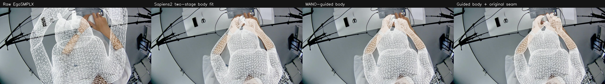
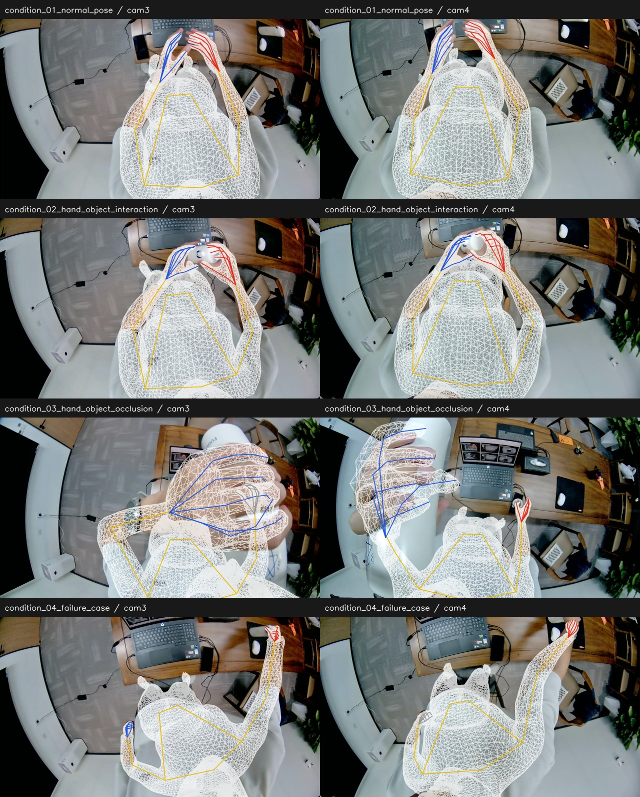
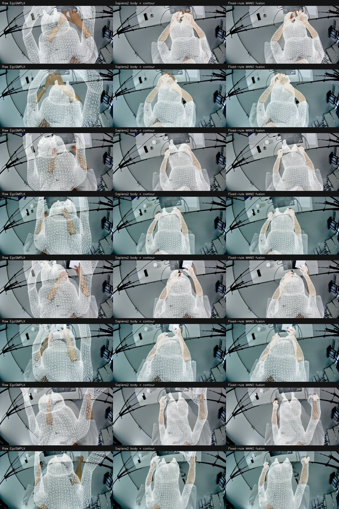
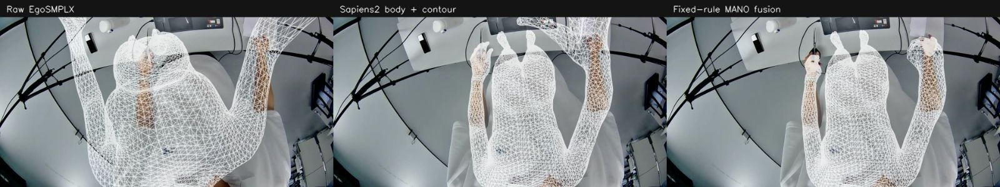

# 当前默认流程验证（2026-09-30）

当前配置：`mano_guided_original_seam_20260929_v1`。代码来源与函数 AST 核对见 [GUIDED_CODE_PROVENANCE.json](GUIDED_CODE_PROVENANCE.json)。以下证据与旧 session_hand6 归档验证分开列出。

| 检查 | 实际执行范围 | 结果 |
|---|---|---|
| 新增身体优化迁移 | condition_01/cam3、condition_04/cam3，从同一冻结自动基线重跑最多1400步新增优化 | 两帧身体核心参数与已确认实验逐值一致 |
| 八帧融合及重载 | 四场景八帧，使用对应身体参数重新执行原接缝、重建和 OBJ 核验 | 全部 NPZ 网格字段逐值一致，最大顶点差0米 |
| 局部穿插 | 同一固定前臂／腕口支持集对完整表面检查 | 4/8通过，其余保留失败诊断 |
| 单元与回归测试 | 默认／旧流程配置、错误配置拒绝、局部穿插、四列／三列报告及原匹配和相机测试 | 15项通过 |
| 续跑与打包 | 校验输入与产物摘要后续跑，打包四阶段结果及新增诊断 | 续跑复用通过；ZIP CRC和76个成员摘要全部通过 |
| 默认控制器完整缓存路线 | session_hand6/sample_01_cam3，重跑1800/1600身体、腕点、轮廓、新增身体增强、原接缝及导出 | 正常完成，4列投影、参数与融合重载通过；该帧局部穿插通过 |

两帧新增优化与八帧网格证据见 [guided_migration_validation.json](guided_migration_validation.json)。默认控制器证据见 [current_controller_validation.json](current_controller_validation.json)。没有把已缓存网络预测描述成重新运行网络；没有重跑全部八帧上游身体拟合。数值一致性是在当前已部署环境中验证，不承诺其他硬件逐位一致。

默认控制器的 sample_01_cam3 最终身体 RMSE 为 **24.19 px**，手部为 **11.74 px**。此帧属于 session_hand6，不能与下表四场景八帧混用。

## 最新四场景八帧指标

| 指标 | 增强前基线 | 增强身体＋原接缝 |
|---|---:|---:|
| 身体100个自动点 | 41.45 px | 37.52 px |
| 身体统一排除鼻点94点 | 40.55 px | 38.57 px |
| 肩肘腕47点 | 53.88 px | 51.71 px |
| 手部294个自动点 | 14.91 px | 17.62 px |

身体参考 Sapiens2，手部参考 WiLoR；四场景8帧14只匹配手，不是人工真值误差。figure9.2 曾用人工身体初始化，仅作事后比较；异常鼻点会主导其身体残差，因此保留排除鼻点的补充口径。逐点结果见 [current_body_rmse.json](current_body_rmse.json)。当前路线改善了部分身体贴合，但未获得稳定的手部增量提升。重载通过与穿插通过分别报告，仍有遮挡和腕部外形问题。

---

# 旧 session_hand6 结果包的复现与验证

验证日期：2026-09-27。参考结果为 `session_hand6_full_pipeline_20260926_v1/results_bundle.zip`，SHA-256 为 `19b9baf80998dbd3f6f0da8f620295251d97a2c9aeeb7c2d282d5c31835e7fd6`。此前首次发布的简化流程及其 13.90 px 手部误差不属于这个参考结果。

## 验证范围

| 验证 | 本次执行内容 | 结果 |
|---|---|---|
| ZIP 完整性 | 核对清单中的 374 个文件长度及 SHA-256 | 全部一致 |
| 8 帧最终网格重建 | 使用归档最终身体参数、WiLoR 预测、冻结身份、轮廓目标和分割标签，执行迁移后的最终融合算法 | 所有 NPZ 网格字段逐值一致，顶点最大差 0 米 |
| 1 帧完整优化重跑 | sample_01/cam3 使用同图自动预测缓存，从原始身体重新执行 1800/1600 步拟合、500+400 步腕点、两组 400 步轮廓、最终表面融合 | 原始/第二阶段/最终身体核心参数与网格完全一致，最终网格所有字段完全一致 |
| 续跑 | 核对已完成结果的输入、代码、配置与逐文件摘要 | 复用验证通过的结果 |
| 现有单元测试 | 匹配、径向投影、相机多项式、拓扑、RMSE、输入检查 | 11 项通过 |

本次没有重新执行全部八帧的神经网络推理，也没有把最终参数重建称为从视频端到端重跑。逐值一致是在已部署的同一模型资源与运行环境中验证的，不承诺其他硬件或依赖版本的浮点输出逐位相同。

原始数值记录见 [八帧重建](archive_reconstruction_validation.json)、[单帧完整拟合](fullfit_reference_validation.json)、[历史结果汇总](reference_result_summary.json)。

## 参考结果的自动点误差

以下数值来自指定 ZIP 的原始汇总，8 帧共 16 只手、100 个身体点、336 个手部点。

| 指标 | Sapiens2 身体校正后 | 完整融合后 |
|---|---:|---:|
| 身体 RMSE | 37.12 px | 31.96 px |
| 手部 RMSE | 84.12 px | 4.41 px |

单帧完整重跑 sample_01/cam3 的最终身体 RMSE 为 32.3343575 px，手部为 4.9423391 px。保存的几何与 ZIP 对应结果完全一致。

参考是 Sapiens2/WiLoR 自动点，不是人工真值。统计先汇总各点平方误差再开方，不对每帧 RMSE 简单平均。

## 叠加图与限制

下图直接取自目标 ZIP；左列为原始网络预测，中列为两阶段身体拟合，右列为腕点、轮廓和局部表面调整后的 MANO 融合。

sample_04/cam3 仍有明显身体偏差和右腕外扩。三个病例最终身体点误差略升；原始预测 7/8 帧包含相机后方顶点，极端原始误差只能作为诊断。几何重载、连接拓扑和局部形变约束通过，不等于所有接缝外观自然或全身表面都准确。

## 复现入口

方法、每阶段命令、历史脚本与新模块的对应关系见 [参考结果完整流程](REFERENCE_PIPELINE_zh.md)。核心数值模块的来源摘要及迁移检查见 [REFERENCE_CODE_PROVENANCE.json](REFERENCE_CODE_PROVENANCE.json)。模型权重、人体模型资源和大型分割概率缓存不随公开仓库分发。
